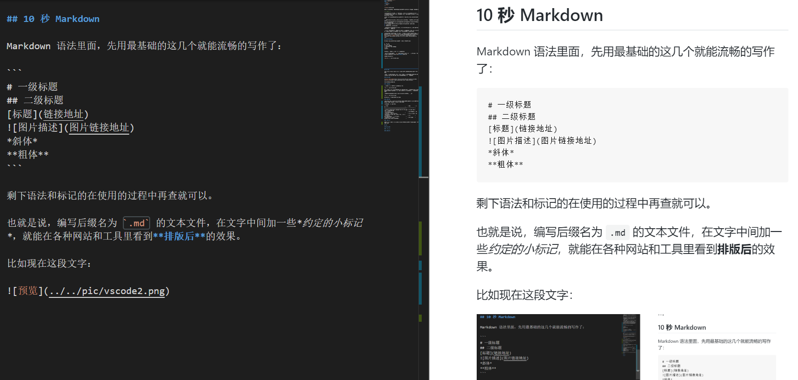
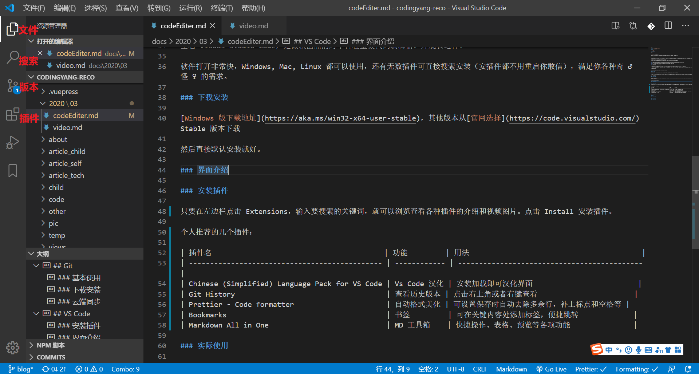
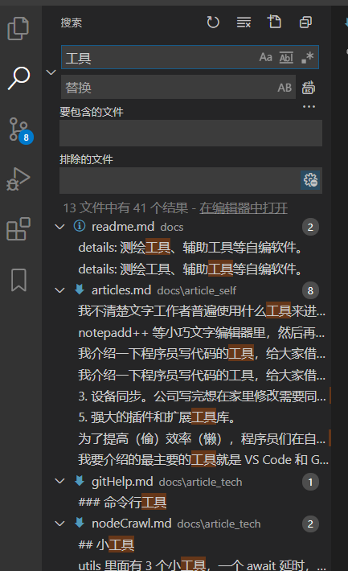
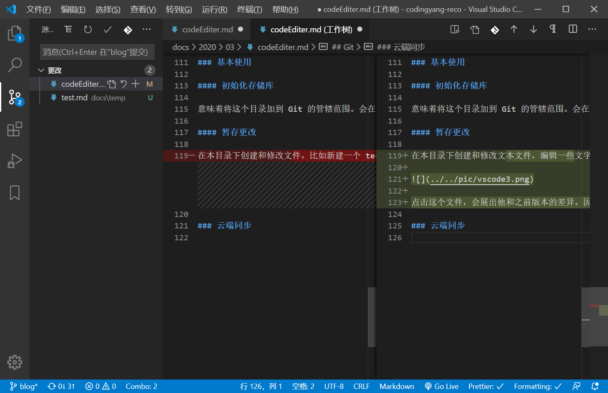
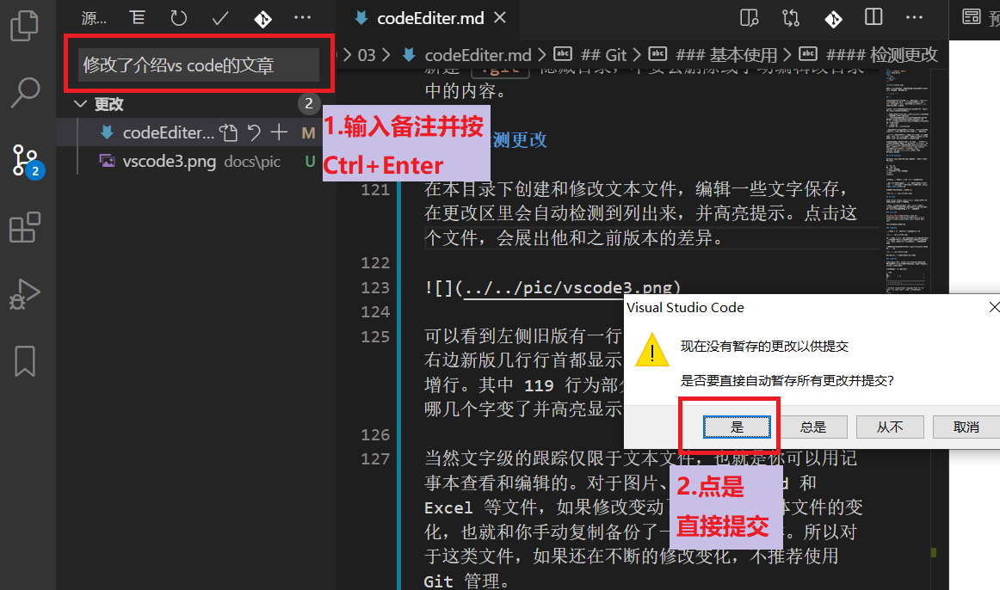
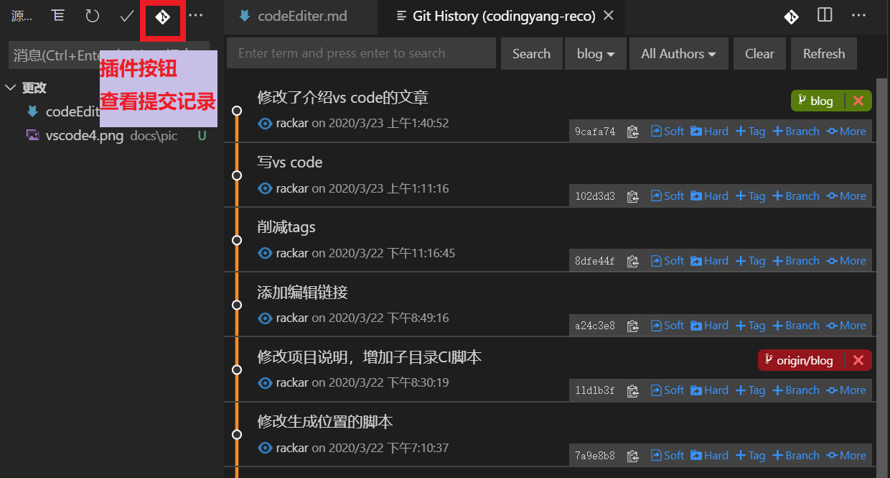
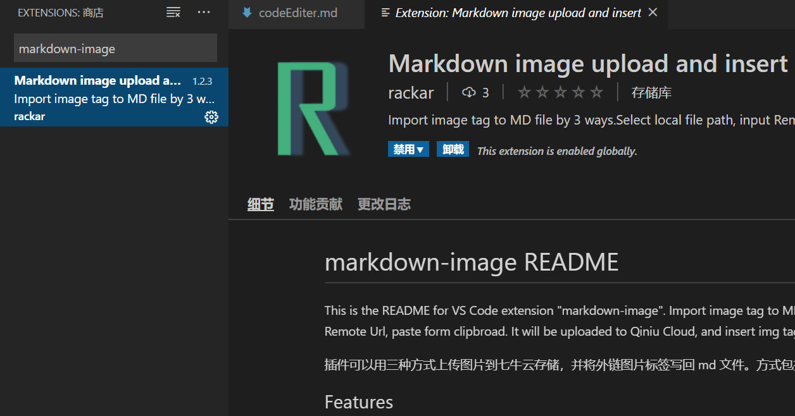

如何像程序员写代码一样来写文章，组合各种便利的工具，实现万无一失的功能。

<!-- more -->

## 前言

我不清楚文字工作者普遍使用什么工具来进行写作，感觉多数以 Word 为主，纯文字的可能主要在 txt, notepadd++ 等小巧文字编辑器里，然后再使用别的工具排版和美化。

我介绍一下程序员写代码的工具，给大家借鉴一下。用这些工具主要解决以下问题：

1. 忘记保存、以及猫咬掉线，错按关机等，导致内容不慎丢失这种喜闻乐见的剧情。
2. 多版本管理。最终版.doc，不改了最终版，不改了最终版 V233。修改历史不好管理，对比不直观。
3. 设备同步。公司写完想在家里修改需要同步工具或者拷过去拷回来。
4. 多人协作。
5. 强大的插件扩展库。

为了提高（偷）效率（懒），程序员们在自用工具改善上的动力和创意是无穷的，毕竟偷懒是第一生产力。

而本身作为代码编写者，和文章作者是有很多类似需求的。所以即使有些用法显得有一点门槛，但还是希望大家勇敢尝试一下，会发现这些玩意的妙处。

我要介绍的最主要的工具就是 VS Code 和 Git。都是跨平台软件。写作推荐使用 Markdown 格式，专注于编写，同时又能做到轻量排版。如果不想本机安装软件也可以使用这个[在线编辑器](https://www.zybuluo.com/mdeditor)，或者[简书](https://www.jianshu.com/)来使用浏览器在线编写和保存 Markdown 文件。

## 10 秒 Markdown

Markdown 语法里面，先用最基础的这几个就能流畅的写作了：

```
# 一级标题
## 二级标题
[标题](链接地址)

*斜体*
**粗体**
```

也就是说，编写后缀名为 `.md` 的文本文件，在文字中间加一些*约定的小标记*，就能在各种网站和工具里看到**排版后**的效果。

比如现在这段源文件和他的预览：



剩下语法和标记的在使用的过程中再查就可以。比如序列、引用、代码块，以及待办列表、流程图、公式等更复杂的功能。

## VS Code

全名 Visual Studio Code，是微软出品的跨平台轻量级代码编辑器。

软件打开非常快，Windows, Mac, Linux 都可以使用，还有无数插件可直接搜索安装（安插件都不用重启你敢信），满足你各种奇 ♂ 怪 ♀ 的需求。

### 下载安装

[Windows 版下载地址](https://aka.ms/win32-x64-user-stable)，其他版本从[官网选择](https://code.visualstudio.com/) Stable 版本下载

然后直接默认安装就好。

### 界面介绍

使用文件 → 打开文件夹定位到文章目录中。



左侧主要的 4 个按钮就是资源管理器、搜索、版本控制和插件。如图现在显示的资源管理器。可以看到编辑器中打开了哪些文件，当前目录文件树和所编辑文件大纲。

搜索就更厉害了。可以直接定位到哪个目录下哪个文件的第几行。



版本控制我们放后面说。先看下插件。

### 安装插件

只要在左边栏点击 Extensions，输入要搜索的关键词，就可以浏览查看各种插件的介绍和视频图片。点击 Install 安装插件。

个人推荐的几个基础插件：

| 插件名                                         | 功能         | 用法                                         |
| ---------------------------------------------- | ------------ | -------------------------------------------- |
| Chinese (Simplified) Language Pack for VS Code | Vs Code 汉化 | 安装加载即可汉化界面                         |
| Git History                                    | 查看历史版本 | 点击右上角或者右键查看                       |
| Prettier - Code formatter                      | 自动格式美化 | 可设置保存时自动去除多余行，补上标点和空格等 |
| Bookmarks                                      | 书签         | 可在关键内容处添加标签，便捷跳转             |
| Markdown All in One                            | MD 工具箱    | 快捷操作、表格、预览等各项功能               |

### 实际使用

首先在菜单 → 文件 → 自动保存打钩，不用担心没有保存这回事了。只要一直写写就 OK。

不过为了自动格式换行插件正常工作，我还是习惯写一行按一下 Ctrl+S 来手动保存。就算没自动保存突然关闭软件也不会丢失内容，但是最好不要太过依赖这种方式。

在编辑 .md 文件的时候，右上角有个按钮叫打开侧边栏预览，可以同步查看排版后的效果，如上图 1。

## Git

Git 是程序员们最爱的版本控制软件没有之一。只要你使用方法得当，这个东西可以把几乎你对文字（代码）的每一次修改变动都记录下来，随时都可能看到每次修改了什么内容，以及可以回退到任何时间的版本。

而且可以云端上传下载，比对不同版本的差异，进行自动或者手动合并。在编程中每一个字母和符号都是受控的，所以尽请放心绝对可以处理好你的文字。

### 下载安装

[官网](https://git-scm.com/)可以下载到各种系统的版本。安装好后，重启 VS Code，在版本（源代码管理）里面就可以看到相应的菜单了。

### 基本使用

#### 初始化存储库


初始化存储库意味着将这个目录加到 Git 的管辖范围。会在目录下新建 `.git` 隐藏目录，不要去删除或手动编辑改目录中的内容。

#### 检测更改

在本目录下创建和修改文本文件，编辑一些文字保存，在更改区里会自动检测到列出来，并高亮提示。点击这个文件，会展出他和之前版本的差异。



可以看到左侧旧版有一行行首标记了一个 `-` 符号，右边新版几行行首都显示了一个 `+` 符号，表明为新增行。其中 119 行为部分文字修改，已经追踪到具体哪几个字变了并高亮显示。

当然文字级的跟踪仅限于文本文件，也就是你可以用记事本查看和编辑的。对于图片、音视频、Word 和 Excel 等文件，如果修改变动了只能记录整体文件的变化，也就和你手动复制备份了一个副本是一样。所以对于这类文件，如果还在不断的修改变化，不推荐使用 Git 管理。

#### 本地提交

更改的文件本应手动放入暂存区，然后从暂存区提交到本地库。

我们这里简化一点，直接在输入框中输入本次提交的备注，然后 Ctrl+Enter 提交到本地库。



这样的提交就相当于一次归档的版本记录。点击上方 Git:view History 按钮（插件功能），可以查看到各次提交的记录和时间、人员，每次记录都可以查看详情、变化，并与其他版本进行对比。



### 云端同步

云端同步就要找个网站来注册一下了。全球通用的 Github 在国内的访问速度不稳定，好在我们有国内的替代（山寨）版本，还有个犀利的名字[码云 Gitee](https://gitee.com/)。简要的介绍下怎么用。

注册登录验证之后，点击右上角+号，新建仓库。


然后输入仓库名称，会自动生成英文或者拼音的项目路径。

选择项目为公开还是私有。注意公开仓库则其他人可以查看项目中文章的所有编辑和删改记录。所以不打算公开的可以选择私有。其他默认不勾选。点击创建。


会出现下面的提示，有一些教你如何连接远程的命令。


这里要用到一点命令。命令在哪输入呢？按查看 → 终端或者快捷键 Ctrl + \` 开启下方的终端命令行，复制或输入命令即可：


首先进行全局的用户设置，推荐设成和 gitee 注册的用户名和邮箱：

```s
git config --global user.name "myName"
git config --global user.email "xxx@xx.com"
```

然后因为我们前面已经初始化过存储库了，所以按照`已有仓库`部分的命令操作就行。也就是下面两行：

```s
git remote add origin https://gitee.com/rackar/my_story.git
git push -u origin master
```

第一行是添加远程库链接，只需执行一次。第二行是推送本地库到远程并设为默认，俗称上传。首次推送时会弹出用户密码框，输入刚才注册时的用户密码。

> 远程库地址 URL 记得换成自己的。

推送成功会如下提示：


后续编辑又提交了本地库之后，可以使用命令 `git push` 直接推送。也可以点击源码管理器右上角的三个点按钮 `...` ，选择推送。


### 多设备同步

想在另一台设备上同步写作的话，也按照上面的方法安装好 VS Code 和 Git。然后用命令行终端运行命令：

`git clone https://gitee.com/rackar/my_story`

会将整个项目下载到运行目录下。

然后每次开机写作前，点击`拉取`从云端拉取最新版到本地。关机前使用`推送`将修改后的版本推送到云端。

### 多人同步

这个操作就要更复杂一些，简要介绍下过程就不展开了。

主要有两种方式，第一种类似多设备同步，但是有时会有同一版本被同时编辑一处的情况，Git 会自动提示冲突在第几行，需要手动选取保留哪一个版本的的哪些内容。

第二种叫 Pull Requests。编辑的人需要 fork（类似拷贝）一份项目，然后修改完 PR 回主项目。主项目管理人需要审阅更改，同意合并才能更新进来。

## 结束语

VS Code 还有各种各样的神器插件来提供人性化的操作。

写作文本时就发现文章添加图片的操作有些繁琐。所以修改发布了一个开源插件。插件中搜索 `markdown-image` 就可以找到和安装。可以一键自动上传截图或者本地图片到七牛云图床，并将外链加入文章内，方便分享。



所以近期还会写一篇介绍申请七牛云免费空间和应用本插件的文章。可以关注公众号 Rackar 来获取更新消息。

本文的主要内容就写到这了。有问题建议欢迎留言。希望能对大家有所帮助。
