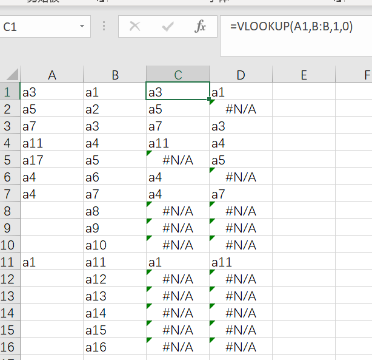

两列数据对比找差异，还是 Excel 最简便。



<!-- more -->

## 命令

```
=VLOOKUP(A1,B:B,1,0)
```

这是查 A 列中的重复值的公式,如 C 列示意。

还可以交换一下顺序查 B 列，如 D 列示意。

### js 查重

为方便自定义还是上代码。Node.js 对比两个文本文件中各行的异同。这笨拙的循环查重算法要是被面试官看到估计会直接被毙。管他呢又不是不能用。

```js
const fs = require("fs");

function diff(urlOne, urlTwo) {
  const s1 = fs.readFileSync(urlOne, "utf-8");
  const s2 = fs.readFileSync(urlTwo, "utf-8");
  const arr1 = s1.replace(/\r\n/g, "\n").split("\n");
  const arr2 = s2.replace(/\r\n/g, "\n").split("\n");
  const resultUnique1 = [];
  const resultUnique2 = [];
  const sameValue = [];
  for (const name1 of arr1) {
    if (arr2.includes(name1)) {
      sameValue.push(name1);
    } else {
      resultUnique1.push(name1);
    }
  }

  for (const name2 of arr2) {
    if (!sameValue.includes(name2)) {
      resultUnique2.push(name2);
    }
  }

  const msg1 = `${urlOne}中唯一数据有${
    resultUnique1.length
  }条，分别为：\r\n${resultUnique1.join("\r\n")}`;
  const msg2 = `\r\n------------------------\r\n${urlTwo}中唯一数据有${
    resultUnique2.length
  }条，分别为：\r\n${resultUnique2.join("\r\n")}`;
  const msg3 = `\r\n------------------------\r\n 重复值有${
    sameValue.length
  }条，分别为：\r\n${sameValue.join("\r\n")}`;
  const msg = msg1 + msg2 + msg3;
  console.log(msg);
}

diff("./diff/A.txt", "./diff/B.txt");
```
