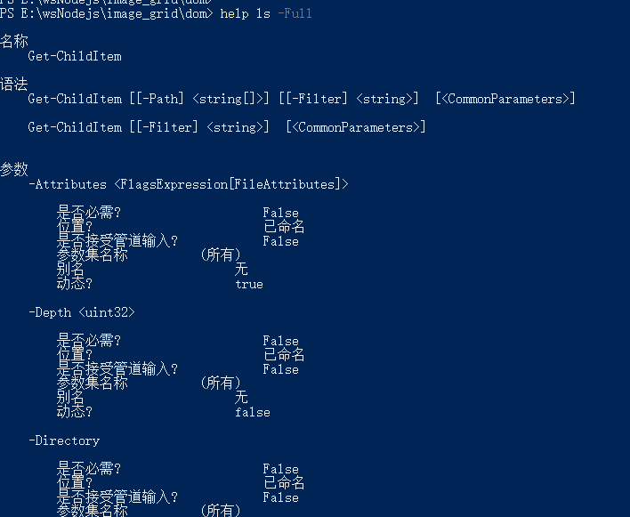
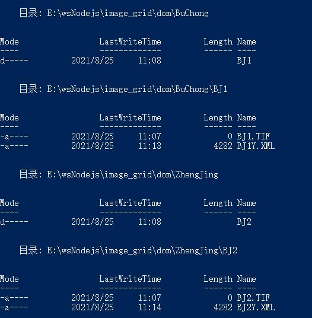
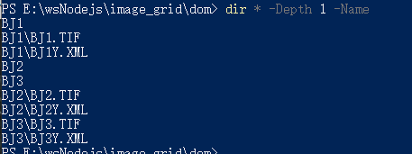

在未联网 Windows 工作站上，经常有大量数据筛选和拷贝的场景。部署和调试 Node.js 太过麻烦，准备捡起命令行脚本，使用 PowerShell 进行编程和批处理。

<!-- more -->

## 基础命令测试

把最基本的命令记录一下。

### 获取命令帮助

这个比较有用，比起一个个搜索，使用时还是看一下具体命令帮助，能有个功能和参数的基本认识。

`help CODE -Full`

比如查看当前目录命令：`help dir -Full`



可以看到原命令名为 Get-ChildItem，不想分页就用这个命令原名, 有相关语法和参数，同时别名为 gci, ls, dir。

对具体某个参数如 Name 可以使用 Parameter

`help Get-Help -Parameter Name`

### 获取子目录下的某些文件名

[官方文档](https://docs.microsoft.com/en-us/powershell/module/microsoft.powershell.management/get-childitem?view=powershell-7.1)

- 遍历本目录及 1 级子目录下的以 BJ1,BJ2 开头的所有文件。  
  `dir BJ1*,BJ2* -Depth 1`  
  或者 `dir -Include BJ1*,BJ2* -Depth 1`

  

- 遍历本目录下所有文件，只要相对目录和名称  
  `dir * -Depth 1 -Name`

  

- 只遍历文件夹可以加 -Directory
  但是要注意递归时有坑。  
  `dir * -Directory -Name`显示子目录列表  
  `dir * -Depth 1 -Directory -Name` 只显示子目录**下级子目录**列表  
  `dir ./ -Depth 1 -Directory -Name` 这个把两级目录都显示出来

- 只要一使用 -Name ，子文件夹深度递归参数就会有些奇怪。要注意：  
  使用`dir -Include *.tif -Depth 1 -Name`查询为空，  
  使用`dir * -Include *.tif -Depth 1 -Name`，查询到 3 个值。注意递归使用\*，匹配特定文件名加 Include.

- 结论 1：遍历下两层的所有 tif
  `dir -Include *.tif -Depth 2 -Name`
  ```
  dir1.tif
  BuChong\dir2.tif
  BuChong\BJ1\BJ1.TIF
  IndexData\dir2.tif
  ZhengJing\BJ2\BJ2.TIF
  ZhengJing\BJ3\BJ3.TIF
  ```

### ROBOCOPY 用法

robocopy 在 window 下是默认安装的，有测评说横向比较复制最快。来看下用法

- `robocopy ./ ../cp *.tif`  
  只拷贝了 dir1.tif

- `robocopy ./ ../cp *.tif /s`  
  拷贝了全部\*.tif 和相应的子目录

- `robocopy ./ ../cp *.tif /e`  
  拷贝了全部\*.tif 和相应的子目录，并且还拷贝了其他不含\*.tif 的空目录出来。也就是说复制了全部的文件夹结构，然后拷贝了目标文件。

### 变量和赋值

执行命令并赋值  
`$names = (dir -Include *.tif -Depth 2 -Name)`

引用值  
`$names`

遍历  
`foreach ($name in $names){echo $name','}`

将多行连成一行  
`$single = $names -join ","`

如果要替换分隔符的话  
`$single =$single -replace ","," "`

### 组合拷贝

拿到了文件名列表，组合拷贝命令

`robocopy ./ ../cp $single /e`
失败，看来不能带路径

继续操作数组，提取文件名部分

```powershell
$total=@()
foreach ($name in $names){
$text = ($name -split "\\")
$total +=$text[-1]
}
$files= ($total -join " ")
```

`robocopy ./ ../cp $files /e`

结果目录复制过来了，但是文件没过来。看来想当然了，以为用空格分割的字符串做为参数传入，就和手敲的表现一致。但是 ps 应该把整个含空格的字符串解析成一个文件名过滤字符串了。所以果断用回数组：

`robocopy ./ ../cp $total /e`

复制成功，达到预期目标。

## 编写脚本

该有的核心代码都备齐了，为了方便使用，将它封装为 cmdlet，输入参数为原目录，目标目录，是否全部复制开关参数，待选文件名列表的位置。

新建 myScript.ps1

```powershell
function Copy-SatData {
  <#
.SYNOPSIS
    拷贝和筛选数据.

.DESCRIPTION
    拷贝和筛选数据.

.PARAMETER SourceDir
    待拷贝数据所在的目录.

.PARAMETER DesDir
    要拷贝去的新目录.

.EXAMPLE
     Copy-SatData -SourceDir D:/data -DesDir E:/data

.EXAMPLE
     Copy-SatData -SourceDir D:/data -DesDir E:/data -List E:/list.txt

.INPUTS
    String

.OUTPUTS
    String

.NOTES
    Author:  Rackar
#>
  [CmdletBinding()] #<<-- This turns a regular function into an advanced function
  param (
    [Parameter(Mandatory)]
    [string]$SourceDir,
    [Parameter(Mandatory)]
    [string]$DesDir,
    [string]$List,
    [string[]]$Fileter,
    [Switch]$onlyFolder
  )

  if ($onlyFolder) {
    if ($SourceDir[-1] -ne '/' -and $SourceDir[-1] -ne '\\') {
      $SourceDir += '/'
    }

    if ($DesDir[-1] -ne '/' -and $DesDir[-1] -ne '\\') {
      $DesDir += '/'
    }


    $filelist = Get-Content $List
    foreach ($name in $filelist) {
      $cmd = "robocopy $SourceDir$name $DesDir$name /s"
      Invoke-Expression $cmd
    }

  }
  else {
    $filelist = Get-Content $List
    $cmd = "robocopy $SourceDir $DesDir $filelist /e"
    Invoke-Expression $cmd
  }

}
```

用法:

```ps
. ./myScript.ps1
Copy-SatData -SourceDir E:\wsNodejs\image_grid\dom -DesDir E:\wsNodejs\image_grid\cp -List E:\wsNodejs\image_grid\dom\list2.txt -onlyFolder

Copy-SatData -SourceDir E:\wsNodejs\image_grid\dom -DesDir E:\wsNodejs\image_grid\cp -List E:\wsNodejs\image_grid\dom\list.txt -onlyFolder
```

拷贝嵌套子目录下的特定文件列表，可使用通配符：  
list.txt:

```
dir1.tif
dir2.tif
BJ*.TIF
```

拷贝特定子目录们下的所有文件：  
list2.txt:

```
BuChong
ZhengJing
```

工具制作完成，每次还需要手动执行才能使用，还是把他放入全局目录，方便直接调用。

## 安装脚本

创建 install.ps1

```
$mpath = ($env:PSModulePath -Split ';')[0]+"/Copy-Data"
mkdir $mpath
cp ./CopySatData.psm1 $mpath
```

如果需要简写以方便使用，输入 sal mcp Copy-Data，这样 mcp 就是别名，可以直接用。但是下次打开 PS 又需要重新设置别名。如果需要永久修改：

```
#先创建个人配置文件
New-Item -Type file $profile
#写入一行命令到配置中
Set-Content $profile 'sal mcp Copy-Data'
#查看
cat $profile
```

没问题的话别名配置就生效了，打开新的 PS 窗口，输入 mcp，已提示管道参数。

至此制作列表文件并拷贝已完成。遍历文件的相关命令还没用上，等待进一步完善。

## 编码问题导致中文乱码

由于 PowerShell 默认配置 GBK 编码，所以通过 UTF-8 编码写入的脚本中的中文会成为乱码。  
解决方法 1，修改本机 PowerShell 代码页的配置为 UTF-8。  
解决方法 2：通过 GBK 编码打开脚本文件，保存成 GBK 编码格式。

## 读写 XML

https://www.pstips.net/loading-and-processing-xml-files.html

```powershell
# $xmldata = (Get-Content .\GF1140579920190502Y.XML -encoding UTF8)
$xmldata = [xml](Get-Content .\GF1C_PMS_E119_7_N42_4_20210519_L1A1021754946_ORTHO_MS_pix.img.xml -encoding UTF8)
$lineage=$xmldata.metadata.Esri.DataProperties.lineage
$projc=$lineage.Process[1]
# 或者
$projc=$lineage.Process | Where-Object{$_.Name -match "投影栅格"}
$text =$projc.'#text'

$string =($text -split " ")[3]
$head ='<?xml version="1.0" encoding="UTF-8"?><PAMDataset><SRS>'
$tail ='</SRS></PAMDataset>'
$result = $head+$string+$tail

$filename="GF2dflksjdfiosdjf"+'.xml'
$result > $filename

# xml格式读取，修改，转string，带格式保存
$xml = New-Object xml
$xml.PreserveWhitespace = $true
$xml.Load($pwd.Path+'/templete.xml')
$xml.Metadatafile.BasicDataContent.MetaDataFileName = "bbb"
$xml.OuterXml >xxx.xml
```

## 参考文档

[模块化官方文档](https://docs.microsoft.com/zh-cn/powershell/module/microsoft.powershell.core/about/about_modules?view=powershell-7.1)
