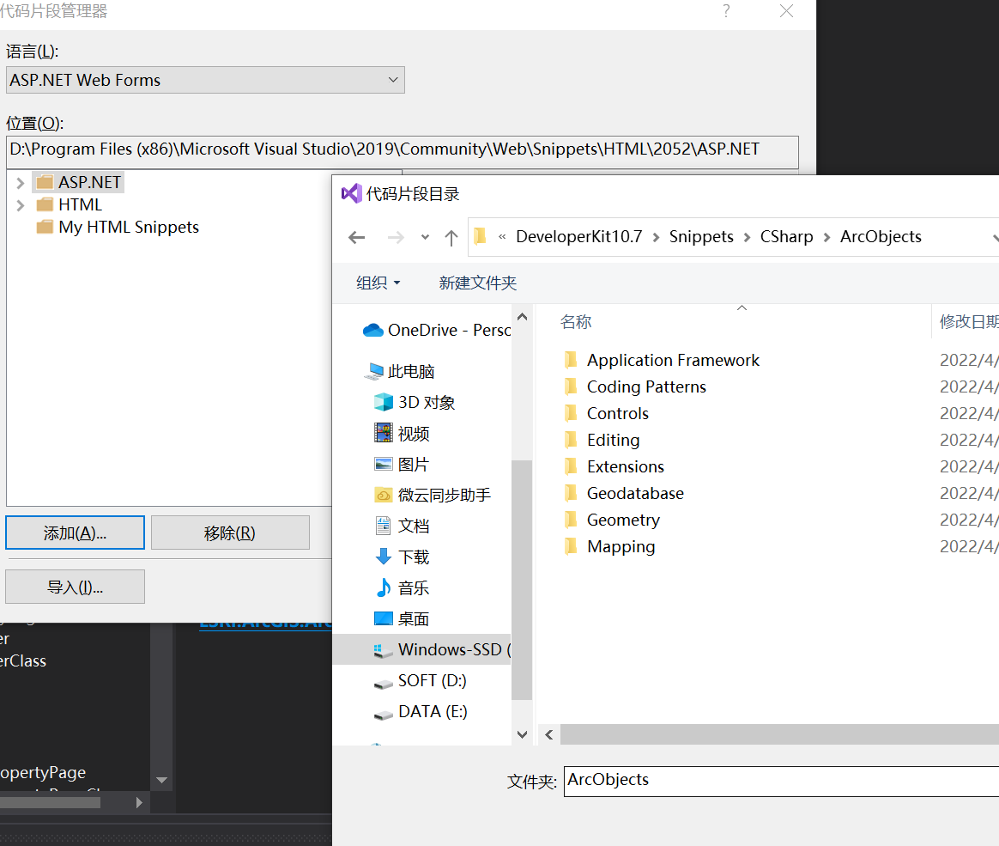

又开坑

<!-- more -->


## 插件初试

10.7安装目录下的ArcObjects_SDK_for_NET_Framework_107_167571.exe

正好是配套的C#开发SDK，已经VS2017以上的话，双击一路安装就行。

VS 中新建项目，模板搜索 arcgis add-ins C#。 添加个button一生成，arcmap中自定义-加载项管理器-自定义...-命令-Addins Controls中将图标拖出到菜单栏。（[参照这篇](https://zhuanlan.zhihu.com/p/148355478?utm_source=wechat_timeline)）

## 开发

VS中解决方案管理器，找到引用下的一个双击

### 添加ArcGIS Snippet Finder
 Tools>Code Snippets Manager - Click on Add... and browse to C:\Program Files (x86)\ArcGIS\DeveloperKit10.7\Snippets\CSharp\ArcObjects



右键-片段-外部代码 #目前有错

删除了一次插件，然后就关联不上了 #问题


[官网文档](https://desktop.arcgis.com/en/arcobjects/latest/net/webframe.htm#WalthroughBuildingCustomUIElementsUsingAdd-Ins.htm)

```js
monumentLayer
  .queryFeatures({
    objectIds: objectIds
  })
  .then((results) => {
    console.log(
      results.features.length,
      "features have been added."
    );
  }); 
```
[图层新增矢量并获取编辑信息](https://developers.arcgis.com/javascript/latest/sample-code/sandbox/?sample=layers-featurelayer-collection-edits)

## 弃坑

由于没找到好的调试方法，开发过于繁琐，暂时弃坑