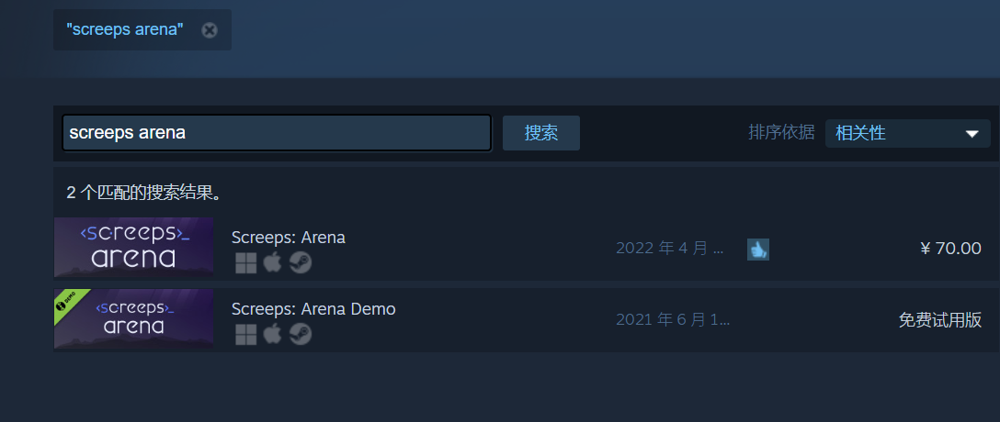
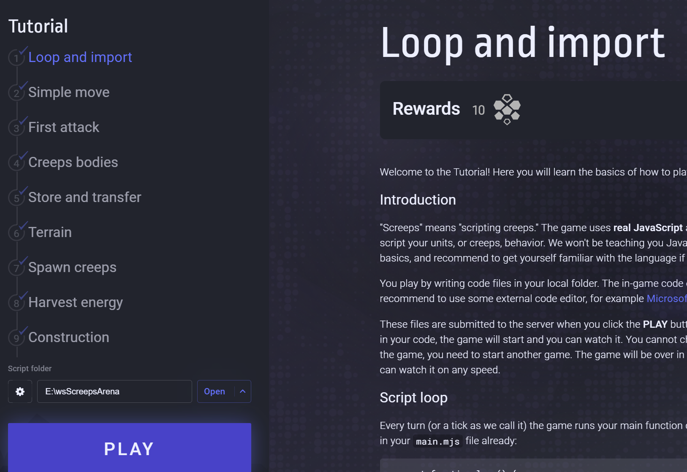
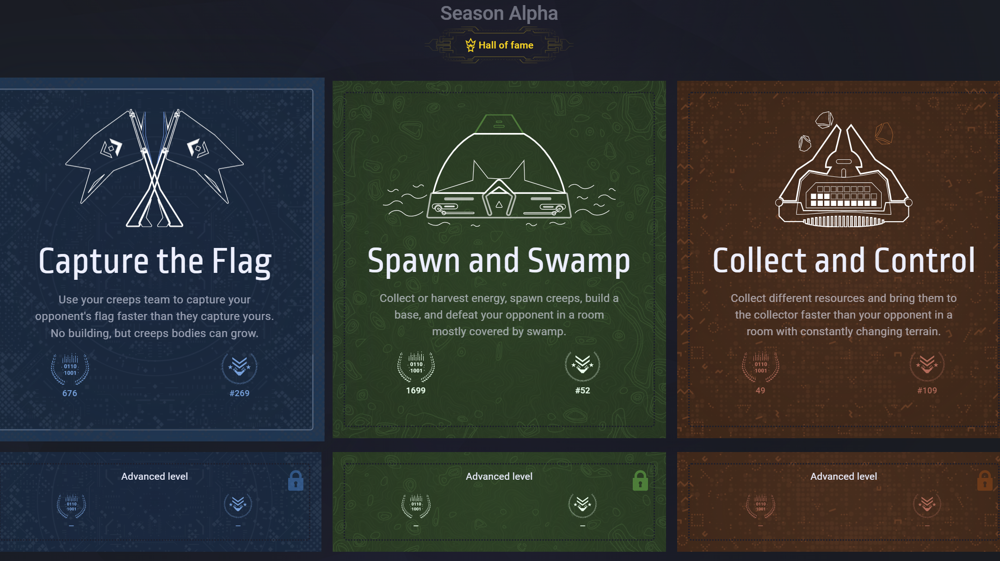
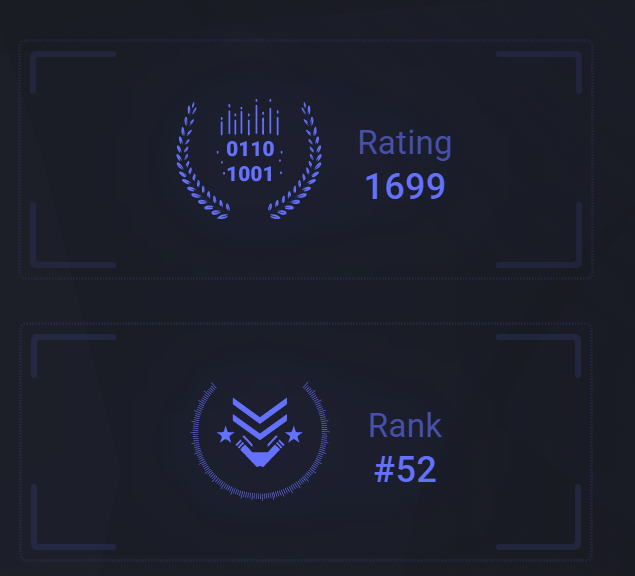
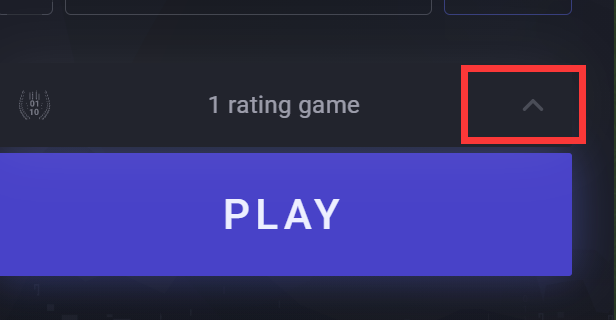
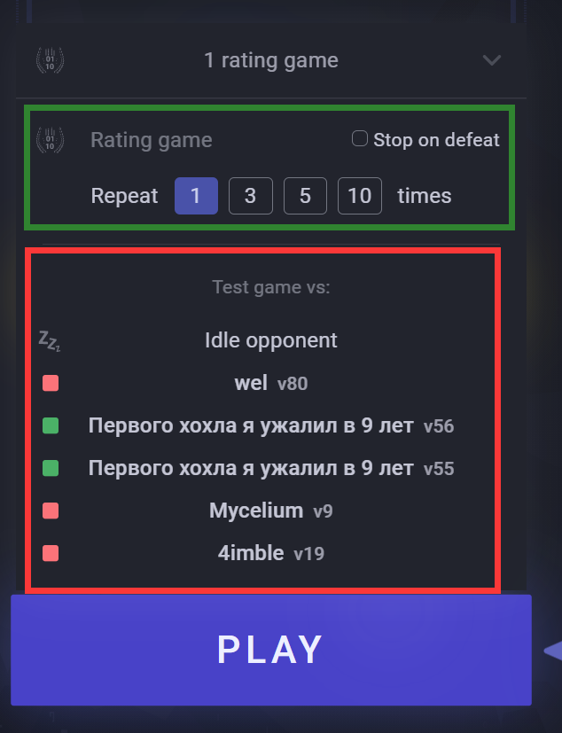
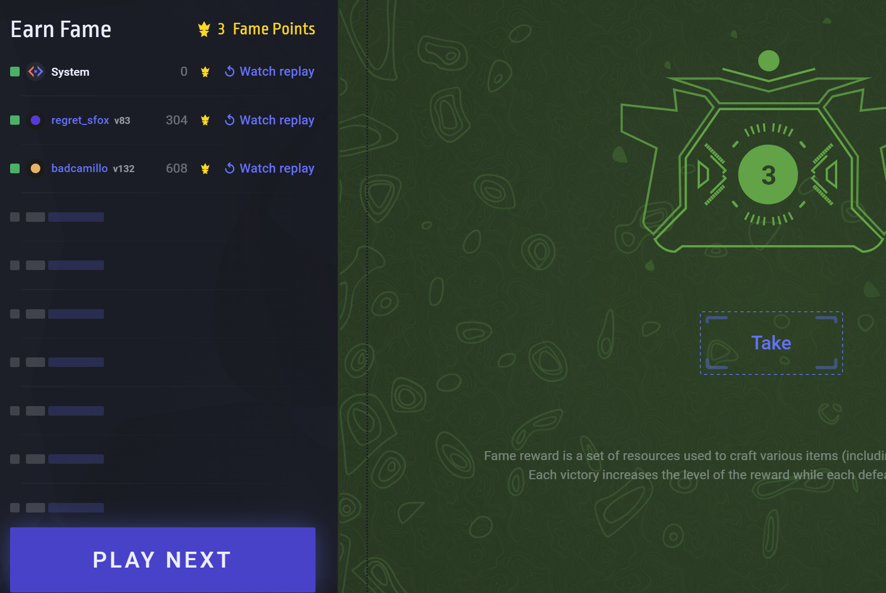
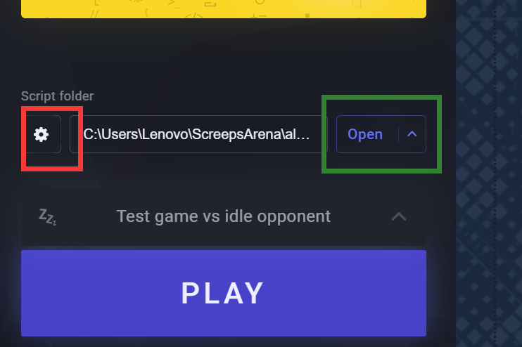
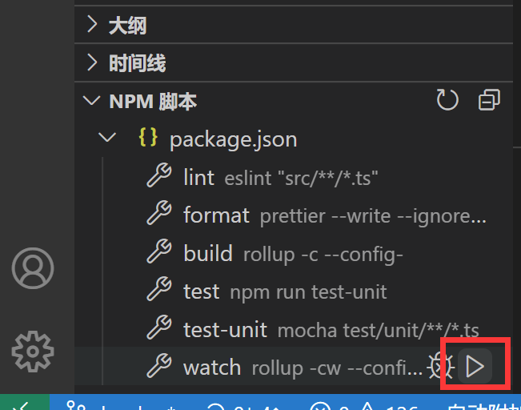
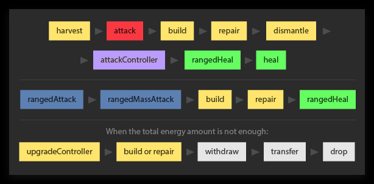

Screeps Arena 是一款类似红色警戒或者星际争霸的RTS游戏，但是你不能靠鼠标指针和实时控制来操作进程，唯一可以用的方法是编程。通过编写JavaScript（或其他语言）代码，控制从采集资源、生产单位、建造、移动、攻击的各种操作和应变逻辑，来让自己的战略运行起来，和其他的代码成果进行对局。

本文是该游戏的一些介绍和入门基础。
<!-- more -->

## 购买安装

Steam中搜索Screeps Arena，当前处于抢先购买阶段，定价为rmb 70元，可使用微信或支付宝，正式版售价不会降低。购买后下载安装运行。



也可以不购买先下载Demo版本，Demo版本只可以进行教程模式的游戏。试试自己能够通关教程，再去购买也是一种稳妥的选择，因为光过完教程也可能也会超两小时退款时间。

关闭游戏以后想再次运行可以从steam中的“库”标签中找到本游戏。


## 游戏内置教程关

初进入游戏界面，三种主要游戏模式都处于锁定状态，首先需要点击右上角Tutorial（教程）按钮，按照教程说明完成10个教程的代码编写和胜利。




胜利都可以Take Reward（获得奖励）。全部通关后可获得100个key fragment(钥匙碎片)，刚好可以在Inventory中兑换一个Basic key（基础模式钥匙），用于开启基础模式。开启基础模式后，还可以使用 300 个key fragment和3种颜色各10个的Upgrade key升级到高级模式。

教程关里有介绍API和游戏方式的说明，很多关卡都提供了示例代码可以直接拷贝使用。只有最后一关第10关是一个小测试，没有示例代码，需要自行理解和组合前面各段代码，正确组合运行。

别看前面示例给的很全，第10关还真的会难住不少新人，因为对游戏机制了解不够的话，用以往的编程经验不一定能顺利过关，这里需要一篇单独的文字详细介绍，暂先空缺。


## 游戏模式

模式分为夺旗、造兵、采集3种模式，主要是地形、初始资源和胜利目标有所不同。




**夺旗模式**：初始给予一些战斗单位和防御塔，目标是占领地方的旗帜。基本纯战斗战术模式。   
**造兵模式**：初始有一个基地，需要自己造兵采集资源，建造军队，打垮对方基地。有一些沼泽地形影响移动。需要生产、运营和战斗。   
**采集模式**：初始有一个基地，需要自己造兵采集资源，目标是双方争夺采集一种特殊资源填充到同一目标容器中，谁先填满或者控制到时间结束为胜。有一些占领和特殊地形的概念。

### 排位赛

每个模式都有天梯对战积分(Rating)和排名(Rank)。点击Rating可以查看自己最近的排名对战记录以及观看录像。点击Rank可以查看整个天梯排名情况。



所对战的敌人主要是处于相近积分的其他玩家当时那个版本的代码。这里的代码有一个版本概念，每次你修改完善自己的代码并进行天梯排名对战时，你这个代码版本就会以v1,v2这样递增的形式保存到服务器，供其他人匹配对战。

高级模式类似，有一些细节不同，积分和排名各自重新计算。

### 训练赛

在排位赛之外，你还可以进行测试赛来调试代码，完善战术。

点击箭头展开匹配设置



绿框是选择排位赛，可以选择进行多次连续战斗，是否失败后不继续排位。

红框就是训练赛，可指定训练对手。




第一个就是系统木桩（System Idle），敌人什么都不会做，你随意发挥。

然后是最近曾对战过5个敌人，尤其是你曾失败过的（红色方块标记），在这个模式如同入虚境一般，一旦你输给他，你可以无数次的调整代码针对他的战术，直到打赢。这也是新手阶段最快的学习和成长模式，一边观察敌人的方式，一边找到打赢他的途径，

### 挑战赛（Fame）

挑战赛每天只可以进去一次，可以收获钥匙碎片为奖励。 在这里最多可以进行十场匹配战斗，每次下一个敌人会比上一次的强力不少。每次胜利可以得到一个成就点和一次奖励升级，但是每次失败会损失双倍奖励。

奖励内容赢一场时10左右个普通钥匙碎片，赢3场大约是14个普通钥匙碎片和2个彩色升级钥匙。但是由于失败惩罚是双倍，如果过贪可能会颗粒无收。由于每次挑战只能点击一次获取收益（Take）按钮，所以在没法保证胜率的情况下，要在已有胜场时提前点击Take按钮，来锁定奖励。

每次第一次匹配的都是Idle，所以代码没成型前一胜就拿奖励走人也算一种日常低保。当然Take之后还可以继续进行下一场Fame，看看自己能打到哪一级。



退出挑战赛后，才可以继续进行排位赛。

## 开始游戏

准备进入游戏前，点击Script folder为本模式选择按钮（下图红框），弹出目录选择窗口，选定当前要使用代码**目录**，游戏会自动将该目录下的main.mjs作为游戏入口程序文件，并加载相关的引用文件（只支持 ES6 模块 import/export 形式）。这些代码会传到服务器上执行，匹配一个通模式的其他玩家的相近等级代码版本作为敌人，战斗结果可以点观战或者查看录像。



右边的绿框Open打开按钮，可以打开所指定的代码目录。推荐下载使用VS Code编辑器作为代码编辑器。


## 使用 TypeScript 模板

推荐使用TS编写游戏代码，因为游戏的代码调试比较麻烦，改一句代码开一局游戏验证比较耗时，使用TS可以提前发现很多代码的bug，我个人感觉至少避免了60%以上问题。

这里一个社区维护的TS模板，基于模板编写自己的程序可以避免大量的配置工作，推荐使用：   
https://github.com/screepers/screeps-arena-typescript-starter

当然了要有要安装Node.js环境。

**用法**
```s
git clone https://github.com/screepers/screeps-arena-typescript-starter
cd ./screeps-arena-typescript-starter
npm i
# 这里由于用到了一个未发布的@types要从Github拉取，所以 npm i 可能会由于墙而失败。
```

安装后src/arena_\*/main.ts是我们要编写源码的入口，`npm run build` 时这些文件都会被编译到dist/arena_\*/main.mjs，也是我们在Script folder中要指定的目录。也可以直接运行一次`npm run watch`，这样每次ts代码有修改保存时会自动编译。

VS Code中也可以通过点按钮的形式启动npm命令。



## 其他技巧

### 代码技巧

main中的loop函数为游戏的主要逻辑的入口，loop会每个tick调用一次，所以如果有想要保留给下个tick使用的变量，可以定义在loop之外。

### spawn 造兵相关问题

spawn问题在新手期常会把人搞晕，我的观察是，在spawn执行spawnCreep的那个回合（取名tick1），如果函数调用成功，可以拿到返回值的object。但是此时object对象的各个字段为空，想存id还办不到，待下一个tick时系统会填充（如id，x,y）才能取到，同时在tick1+1中GameObject已经在地图上可以点击，

### 动作同时执行优先级



见文档 https://docs.screeps.com/simultaneous-actions.html


### 寻路函数文档测试


```js
// 有3个方法
moveTo(
      target: RoomPosition,
      opts?: MoveToOpts
    )
findPath(fromPos, toPos, [opts]) //默认忽略障碍

searchPath(origin, goal, [opts])

let opts={
  costMatrix,// 地形导航代价数组
  ignore,    // 需要忽略的位置数组，会被认为是墙
  plainCost, // 平地区域代价 默认2
  swampCost, // 藻泽地区代价 默认10
  flee,      // 是否逃离 默认false
  maxOps,    // 最大步数
  maxCost,   // 最大路径代价
  heuristicWeight //启发权重。1-9的权重，应用于A*算法(A-Star)。F = G + weight * H 默认值1.2
}
```
[关于A*算法](https://blog.csdn.net/qq_35247337/article/details/121099995)

使用flee的时候，会计算离目标距离为range远的最小代价目标点。所以必须使用`goal={pos,range}`的结构传入target