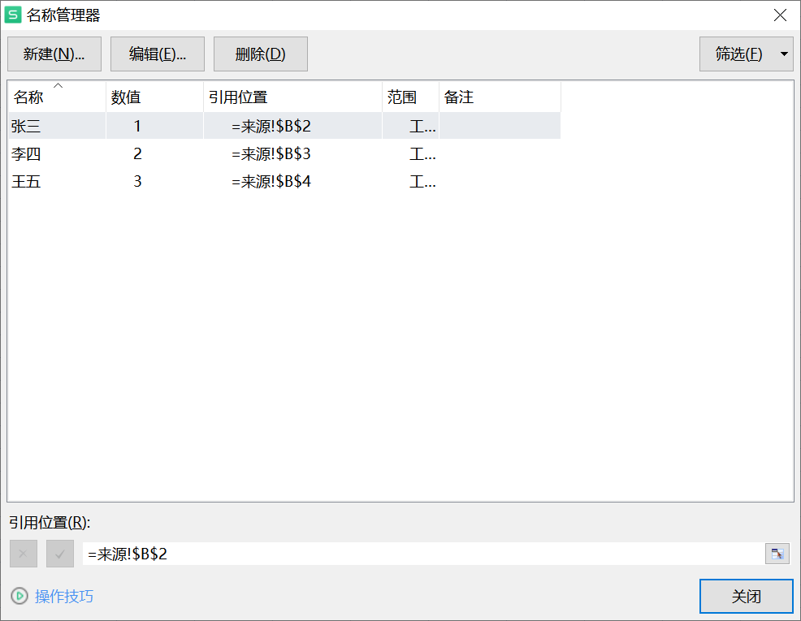
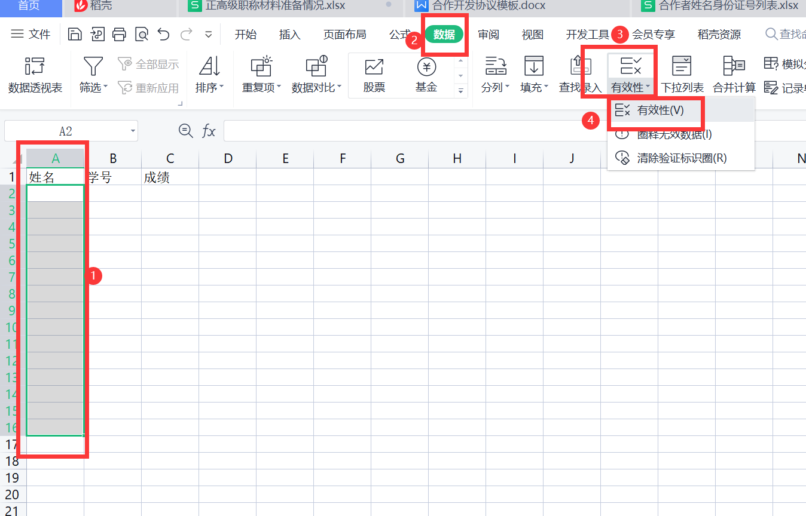
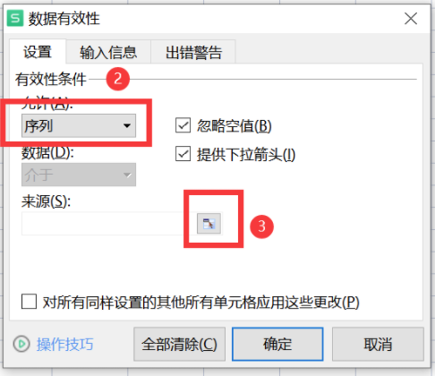
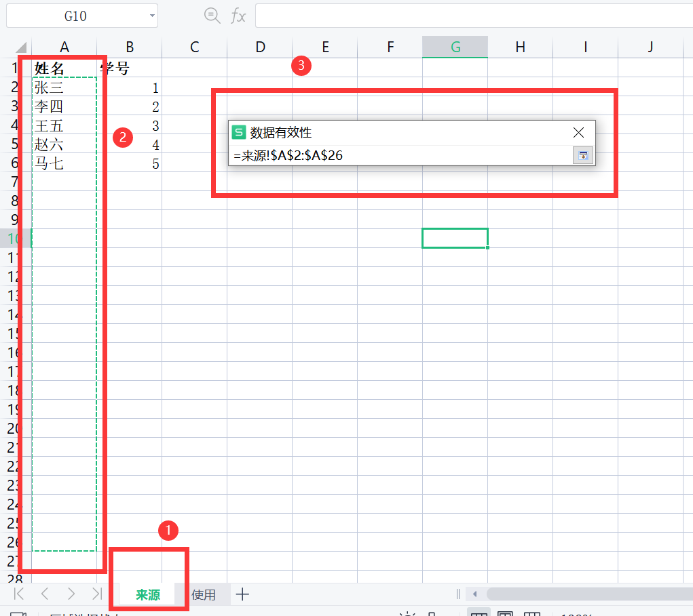
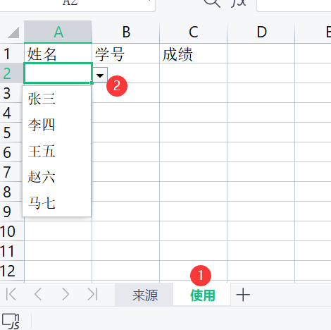
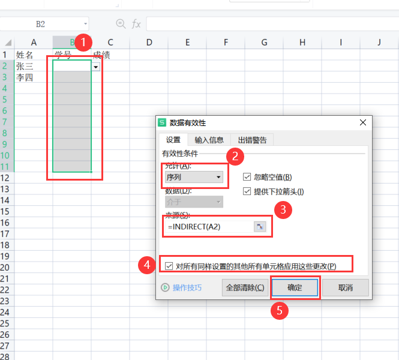
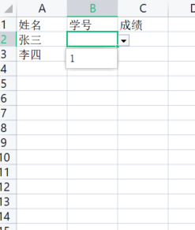
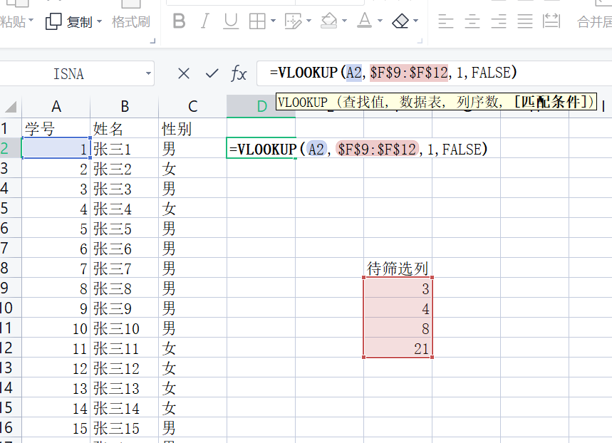
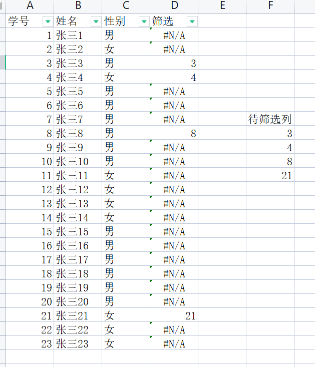
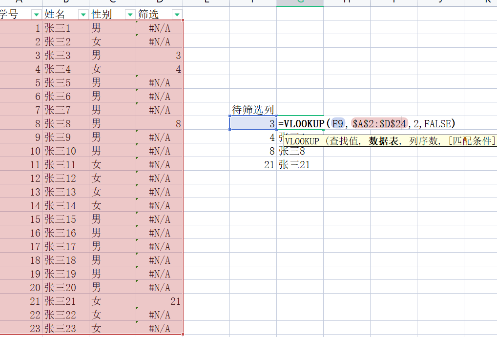

Excel / WPS 有一些复杂的技巧需要记下来，以免下次又忘了怎么做。当前有多级下拉菜单选择, 单元格内的多选值(如逗号分隔)拆分为多行的平表。

<!-- more -->

## 制作多级下拉菜单选择
Excel / WPS 中如何根据某些数据表来限定输入，比如维护一个姓名和学号表，在另一个sheet中可以下拉选择姓名和约束对应学号而不是通过复制输入。
### 数据来源表

WPS中选中2列数据跳过标题，点击公式——指定（Excel：根据所选内容创建）——最左列——确定


这个操作其实就是将数据保存为了名称，在名称管理器中可以看到详情：





### 数据使用表

1. 姓名列下拉

在使用表sheet，选中要填入姓名的列，点击数据——有效性——有效性（Excel:数据——数据工具——数据验证）



选择允许为：序列，点击指定来源按钮





点击来源表，框选要填入的性名列（可以多选几行方便扩展）




回到使用表，已经可以选择姓名


2. 对应学号下拉

选中使用表学号列，同样点击数据——有效性——有效性，修改为序列，来源这里输入公式`=INDIRECT(A2)`，打钩应用，确定。   



下拉选择姓名后，可以下拉选择对应的学号。



### 数据源增加

由于我们之前操作都多选了几行作为预留，所以如果要新增数据源，只要把新增部分做名称指定就行。

比如现在添加一条新纪录，只需要选中新添加行，公式——名称——指定。


在使用表中可以直接下拉选择到新的数据。

## 拆分单元格内多选值

在某些表内限定行数作为记录条数，有在同一单元格内有放多个值逗号分隔这种类型。

统计多选值时又需要把逗号拆分。这里介绍Excel中一种复杂的工具 Power Query

选中表格后点击数据-来自表格/区域, 选中要拆分的列, 点击转换-拆分列-按分隔符, 选择分隔符，视情况选择高级选项-行或者列，确定后, 点击主页-关闭并上载, 结果为新建的Sheet。

## 公式模板记录

```excel
1.条件判断公式 逻辑或
=IF(E5="是","是",IF(OR(E5="否",E5="",E5="<空>"),"否","其他"))

2.中间表引用原表的列
='Sheet1'!A:A
```

## Vlookup查找数据
### 通过一列编号筛选另外一张表中的部分行

经常有一张台账表需要从中取出部分数据，比如一张学生表，其中学号为3,6,8,21的所有行需要筛选出来，可以用Vlookup实现。比如下表，D2的公式为`=VLOOKUP(A2,$F$9:$F$12,1,FALSE)`

公式中的A2为待筛编号值。

`$F$9:$F$12`为准备筛选出来的目标编号组，这里必须用`$`做绝对定位，公式下拉填充时才不会发生引用序号变化。下一行的公式正确填充值为`=VLOOKUP(A3,$F$9:$F$12,1,FALSE)`。

1为数据表中的列数

FALSE表示精确匹配，而非模糊匹配。



整列填充后，某行如果筛选命中，就会显示值，否则显示`#N/A`。所以只要对结果筛选，就可以方便得到目标行。



### 从表查找引用主表值
如果是在其他表中查找主表中的特定值，需要反用这个公式。

比如还是这个例子，我需要在待筛选列后面查找原表中对应的姓名。使用公式`=VLOOKUP(F9,$A$2:$D$24,2,FALSE)`



也就是，在A2-A24这列查找F9的值，精确命中后，选择第2列的值填充在本单元格。由于这里的范围是A2-D24，所以可选列值为1,2,3,4。

这个用法的特点是，数据表(第二个参数)选中多列后，只会查第一列的匹配情况，后面多扩中的3列仅为了提供列序数(第三个参数)来定位结果。