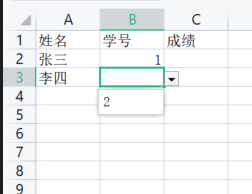

Excel / WPS 中如何根据某些数据表来限定输入，比如维护一个姓名和学号表，在另一个sheet中可以下拉选择姓名和约束对应学号而不是通过复制输入。

<!-- more -->

## 数据来源表

WPS中选中2列数据跳过标题，点击公式——指定（Excel：根据所选内容创建）——最左列——确定

这个操作其实就是将数据保存为了名称，在名称管理器中可以看到详情：

## 数据使用表

1. 姓名列下拉

在使用表sheet，选中要填入姓名的列，点击数据——有效性——有效性（Excel:数据——数据工具——数据验证）

选择允许为：序列，点击指定来源按钮

点击来源表，框选要填入的性名列（可以多选几行方便扩展）

回到使用表，已经可以选择姓名

2. 对应学号下拉

选中使用表学号列，同样点击数据——有效性——有效性，修改为序列，来源这里输入公式`=INDIRECT(A2)`，打钩应用，确定。   

下拉选择姓名后，可以下拉选择对应的学号。

## 数据源增加

由于我们之前操作都多选了几行作为预留，所以如果要新增数据源，只要把新增部分做名称指定就行。

比如现在添加一条新纪录，只需要选中新添加行，公式——名称——指定。

在使用表中可以直接下拉选择到新的数据。