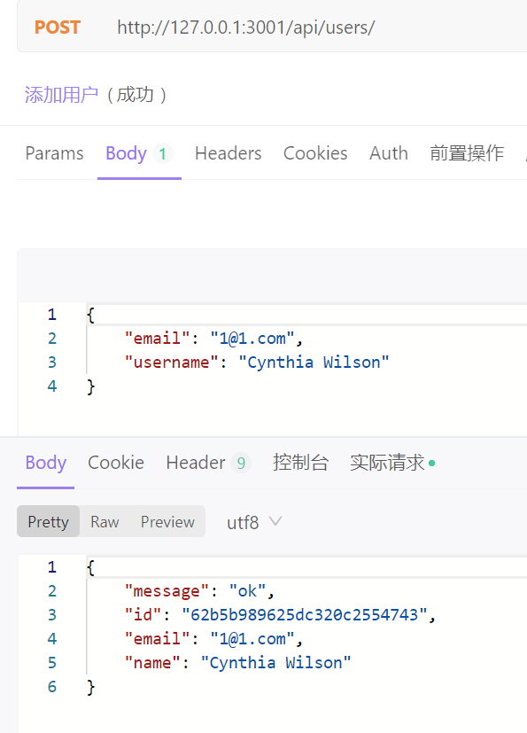

又一个新的ORM框架，但是Prisma宣传是下一代ORM。下一代、次时代的说法也太多了，不知道从哪起算……

<!-- more -->
## Prisma简介


但是粗略看了下确实非常不错。TypeScript, Node.js，正好贴合我的习惯，数据库支持MySQL, PostgreSQL, MongoDB和一些其他的，足够用。通过数据模型直接生成数据库表结构，也无需再次定义TS类型，点赞。关联表的操作非常直观，有些API写法类似Mongo和Mongoose，上手不复杂。

我主要是从 https://github.com/unix/koa-ts 这个库了解到该框架，本文大多数代码都来自此库。但是由于运行报错，本机也只装了MongoDB没有PG环境，就自己尝试一步步组装一个MongoDB的版本。

本文的涉及的源码和步骤都放在了 [Github](https://github.com/Rackar/prisma-koa-mongodb-starter)

可以直接克隆 `git clone https://github.com/Rackar/prisma-koa-mongodb-starter.git` 

对了，推荐使用pnmp代替npm和yarn。用法类似yarn，全局安装`npm i -g pnpm`

本文的运行命令都是使用pnpm

[mongoose迁移到Prisma](https://www.prisma.io/docs/guides/migrate-to-prisma/migrate-from-mongoose#collection-name-inference) 

## MongoDB转换为副本集

首先需要将Windows本机的MongoDB转换为副本集，因为Prisma的事务需要，在配合MongoDB时需要连接副本集。
如果是其他关系型数据库则不需要。

1. 暂停本机mongodb
    使用管理员权限打开powershell
    ```s
    net stop MongoDB
    cd "D:/Program Files/MongoDB/Server/4.4"
    # 确定本目录下有data和log目录
    ./bin/mongod.exe --port 27017 --dbpath ./data --logpath ./log/mongod.log --logappend --replSet rs0 --bind_ip localhost
    ```
2. 保持这个PS窗口不要关闭，另开一个新的PowerShell：
    ```s
    cd "D:\Program Files\MongoDB\Server\4.4"
    ./bin/mongo
    rs.initiate()
    show dbs
    ```
    测试成功说明副本集可以正常开启。但是手动窗口参数启动比较麻烦，还需要一直前台开启，我们下步修改服务配置，开启默认使用副本集设置。
3. 修改服务配置文件
    修改 `D:\Program Files\MongoDB\Server\4.4\bin\mongod.cfg` ，增加这两行。
    ```
    replication:
      replSetName: rs0
    ```

    整个配置文件如下：
    ```conf
    # mongod.conf

    # for documentation of all options, see:
    #   http://docs.mongodb.org/manual/reference/configuration-options/

    # Where and how to store data.
    storage:
      dbPath: D:\Program Files\MongoDB\Server\4.4\data
      journal:
        enabled: true
    #  engine:
    #  mmapv1:
    #  wiredTiger:

    # where to write logging data.
    systemLog:
      destination: file
      logAppend: true
      path:  D:\Program Files\MongoDB\Server\4.4\log\mongod.log

    # network interfaces
    net:
      port: 27017
      bindIp: 127.0.0.1


    #processManagement:

    #security:

    #operationProfiling:

    #replication:
    # 为了Prisma需要，开启副本集
    replication:
      replSetName: rs0
    #sharding:

    ## Enterprise-Only Options:

    #auditLog:

    #snmp:
    ```

    保存后重新启动服务或用命令`net start MongoDB`

## 安装和初始化项目


[按照官网教程安装](https://www.prisma.io/docs/getting-started/setup-prisma/start-from-scratch/mongodb-typescript-mongodb)

这步安装和初始化了Prisma数据演示结构和Client。可以使用ts执行。

启动脚本为 `pnpm go`
```js
"scripts": {
    "dev": "prisma generate",
    "go": "ts-node ./src/index.ts"
  },
```

查看截止此步的源码：
`git checkout dbc5ee2e8cabd970e915242049d7ac25e1ce6219`

[或者在Github上查看](https://github.com/Rackar/prisma-koa-mongodb-starter/commit/dbc5ee2e8cabd970e915242049d7ac25e1ce6219)

### 添加koa进行接口查询

```s
pnpm add koa koa-bodyparser koa-logger koa-multer koa-router
pnpm add -D @types/koa @types/koa-bodyparser @types/koa-logger @types/koa-router
```

进行演示性api编写
```js
  const app =await createServer()
  app.use(routes.routes());


  router.get("/", async (ctx) => {
    await list(ctx)
  })

async function list(ctx){
  const allUsers = await prisma.user.findMany({
    include: {
      posts: true,
    },
  })
  ctx.body = {
    message:'ok',
    data:{ allUsers }
  }
}
```

`GET http://127.0.0.1:3002/api/test/` 成功返回结果

查看截止此步的源码：
`git checkout c2e624ff20af57065d63c316f364d4819d09a31b`

[或者在Github上查看](https://github.com/Rackar/prisma-koa-mongodb-starter/commit/c2e624ff20af57065d63c316f364d4819d09a31b)

## 添加routing-controllers进行装饰


```s
pnpm add routing-controllers reflect-metadata typedi class-validator class-transformer dotenv
```

 添加装饰器、反射，环境适配。测试装饰器路由
```ts
@Post('/users')
  async create(
    @BodyParam('email') email: string,
    @BodyParam('username') name: string,
  ) {
    if (!name) {
      throw new BadRequestError('username is required')
    }
    return await this.usersService.create({email, name })
  }
```



测试添加用户成功。拦截器生效具有ok字段。入参username,后续name, 可以正常适配。

`GET http://127.0.0.1:3001/api/users/` 接口已通。可以查询、新增（POST）

查看截止此步的源码：
`git checkout 8a86312a746b84c35558444196e42cb37b059a9a`

[或者在Github上查看](https://github.com/Rackar/prisma-koa-mongodb-starter/commit/8a86312a746b84c35558444196e42cb37b059a9a)