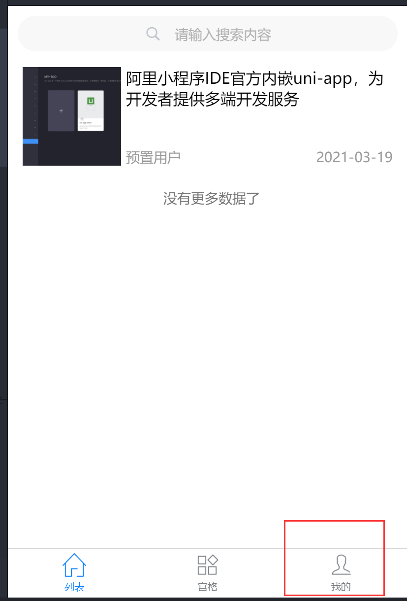
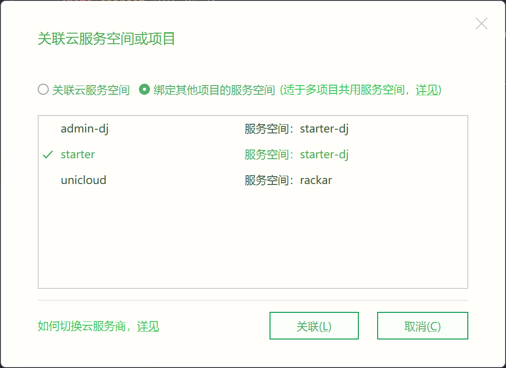
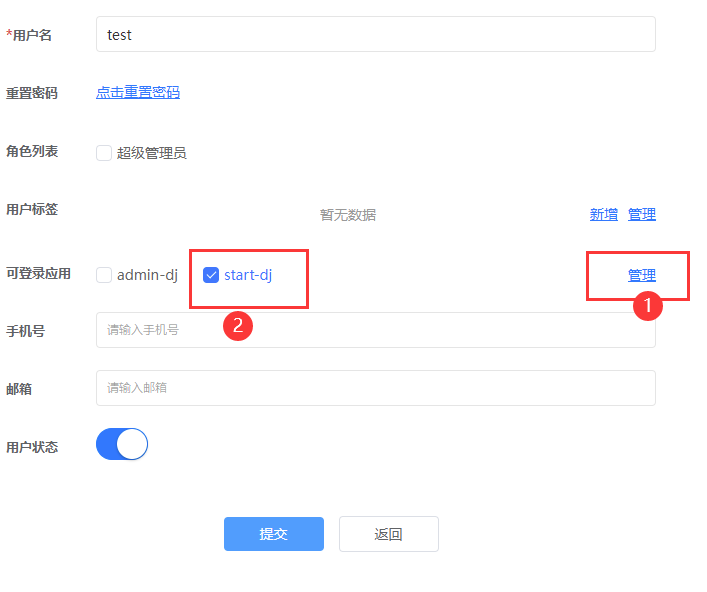
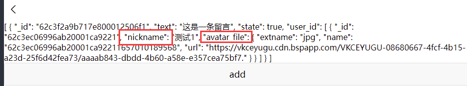
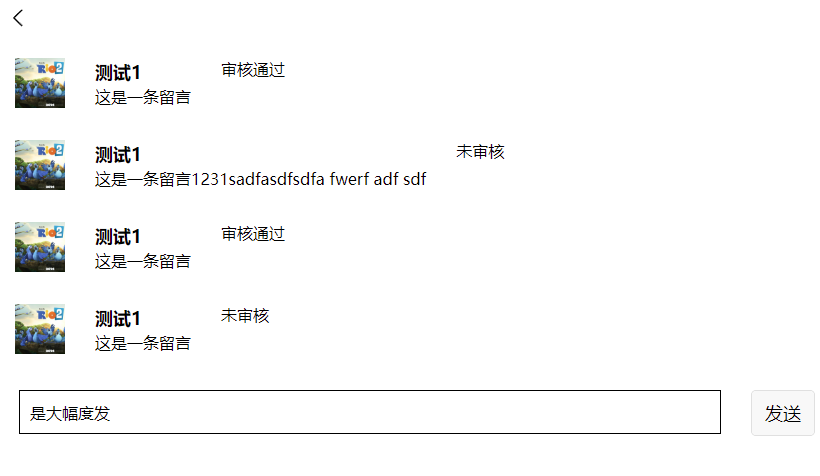
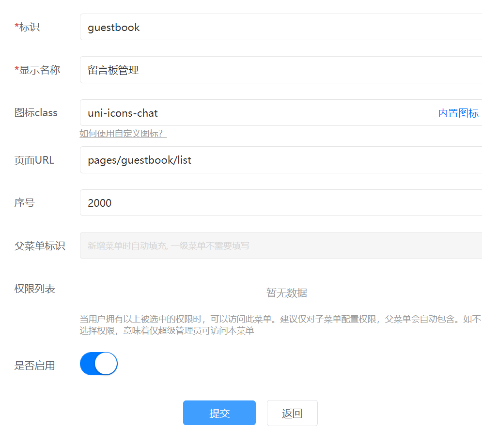

UniCloud云开发做了很多套路模板和工具，可以非常快捷方便的在上面做完整应用。本文是按照视频教程和官方文档总结的开发入门教程。

<!-- more -->

## Uni Cloud简介
两三年前尝试过UniAPP开发小程序，主要使用Vue可以跨端生产各种产品，包括H5, APP, 小程序等。只不过是各种特殊情况会需要单独处理，导致混起来也难以精通理解。

最近想快速实现一个简易的原型系统，本来想去用微搭，可是回看发现 Uni Cloud 已经比较成熟了，通过一套数据模式自动生成代码的方式，以及封装好直接可用的前端模板和管理模板，配合上免费的后端云开发环境，已经可以无脑快速的构建成型系统。

当然了别人喂到嘴边的框架，就存在熟悉和适应各种开发流程工具的过程，也需要摸清用法，掌握规则。所以使用框架需要慎重选择，免得技术和认知成本铺上去了，等到过时或者出更好的选择时，之前的投入不通用导致白费。

我现在观察uni app和uni cloud已经具备比较成熟应用的条件了，决定还是All in扑上去。以这家公司的产品力和更新迭代能力，相信这条线几年内不会被淘汰。

但是由于dcloud的产品和解决方案以及插件/库/模板过于多，阅读文档所需关联知识、背景知识太多，对新接触者的门槛较高，所以还需要自己整理和记录一下，努力搞清楚结构和互相的依赖。

官网文档适合查阅相关的API，没有特别顺畅的入门教程。但是发现官方在B站发了一套视频，还是非常能体现这套技术的简易和便利之处的。[B站链接](https://www.bilibili.com/video/BV17p4y1a71x?p=11&vd_source=c87dc9845f7c867ab22500a654a58698)。推荐从头看，时长不算长，但是把一些便利的点都讲清楚了。视频里面还夹杂了很多看起来非常流畅的小技巧，但是对不熟悉的人，一个小操作就可能是一个很难解决的大坑。所以把视频里的一些流程和技巧都整理记录下来，方便开发时查阅。


## 相关知识

UniCloud云开发：依托阿里云和腾讯云提供免费的后端服务器和数据库资源。（正常需求能满足，万一爆了还能扩）。定制交互写云函数。   
Uni-starter 模板，可以快速搭建用户登录、注册权限等基础功能。   
Uni-admin模板，可以与前端模板连接，做到增查改删自动生成代码和页面。

上述两个模板基于Uni-id，一套全局uid和token管理方案。还基于Uni-config，配置解决方案。

数据库方面有：   
DB Schema，可以进行前端增查改删和json定义数据结构，生成可用的前后端代码。   
ClienDB，前端交互数据库。由于数据模式中有权限定义，不用担心前端交互导致的数据库安全。

## 基本流程

### 下载安装HbuildX

[下载解压](https://www.dcloud.io/hbuilderx.html)，然后执行哪步提示缺少控件或者依赖就点击下载，软件会自动后台下载解压应用。使用VS code快捷键。软件的双击快捷选择非常好用，强烈推荐。

### 根据starter创建前端页面
HbuilderX中新建项目，选择starter模板，vue3，托管代码到私有仓库，云开发选阿里云，新建云服务空间starter-dj

然后向导会部署云资源(主要是云函数上传和云数据库建表和初始化)，提示创建表时勾选全部创建。等提示初始化云数据库完成为止。点击预览等待编译。如出现`ERR_OSSL_DSO_COULD_NOT_LOAD_THE_SHARED_LIBRARY: errCode: ERR_OSSL_DSO_COULD_NOT_LOAD_THE_SHARED_LIBRARY | errMsg: error:25078067:DSO support routines:win32_load:could not load the shared library` 可能是云端问题，等待几秒刷新。预览窗口底部如果没有tab栏，切换预览为PC模式或者小屏手机。



切换底部标签页，看到starter模板已经内置了列表查询，点击进入详情，宫格中滑动页组件，按权限渲染，以及我的中的账户登陆、管理和设置。

### 根据admin创建后台管理页面

新建项目admin-dj，模板选择uni-admin,服务空间选择starter-dj。部署时如遇到已有的依赖提示，则选跳过，免得覆盖starter已上传的部分。也就补充部署2个云函数上去。

在admin-dj目录下的uniCloud目录名上右键，点“关联云服务空间或项目”, 绑定其他项目的服务空间-选择starter。 这样意思是管理端和前端共用一套云端的数据、函数的服务器空间。



点击运行-运行到浏览器-chrome，等待编译。

进入管理页以后新建初始管理账号admin。然后登陆，并屏蔽掉初始化按钮代码(admin-dj/pages/login/login.vue 35-37行 initAdmin部分)。左边菜单选择用户管理，新增用户test。这里手动添加新用户信息，同时在可登陆应用处点击管理，新增应用：从starter项目的manifest.json中复制第一行的AppID，填入保存。返回用户新增这里，勾选可登陆应用：starter项目。



现在可以试试回starter项目，使用test账号登陆成功。

## 留言板开发流程

### 一. 登陆才可以创建留言
1. ucenter右键新建页面。命名guestbook。ucenter.vue中找到数组合适位置，复制一个跳转元素并粘贴guestbook地址。可以修改icon为chat。
2. 取消页面的登录跳转。starter.config中添加白名单
3. 首先在uniCloud/database右键新建DB Schema，添加guestbook数据表schema，添加字段text,state,user_id。保存后右键上传，创建表。在uniCloud目录右键第三项打开web控制台，可以看到云数据库中已经有本表名。
4. 前端添加新增按钮使用db去测试新增。
    ```js
    const db = uniCloud.database();
    let dbIns = db.collection("guestbook")
    dbIns.add({
      text: "这是一条留言",
      state: true,
      "user_id": "dskfjaosdif"
    })
    ```
    由于默认DB schema中权限为全禁止，修改permission create: auth.uid!=null, 即登陆用户才可创建。

    登陆后点击添加，刷新web控制台guestbook表，看到提交的数据。
### 二. 新留言需要审核才能展示 

1. DB Schema设置强制默认值。这样传true报错，不会存入数据。
    ```js
    "state":{
          "bsonType": "bool",
          "forceDefaultValue":false
        },
    ```
2. 限定uid从token中解析，非参数直接传递。这样add方法只传text就够了。
    ```js
    "user_id":{
          "bsonType": "string",
          "forceDefaultValue":{
            "$env":"uid"
          }
        }
    ```
3. 展示列表。view标签中输入快捷键udb回车，表源选guestbook。 v-else中输入{{data}},将回查结果显示。显示权限问题，则修改DBS中permission read 为`doc.state==true`限定查询条件，此时数据结果要求权限只能查询过审留言，但是前端默认查所有数据，也会报超出权限，所以需要缩小前端查询范围，给cdb标签添加where:
    ```html
    <unicloud-db where="state==true" v-slot:default="{data, loading, error, options}" collection="guestbook">
          <view v-if="error">{{error.message}}</view>
          <view v-else>
            {{data}}
          </view>
        </unicloud-db>
    ```

4. 关联查询。   
    给DBS中的user_id添加`"foreignKey": "uni-id-users._id",`即将guestbook.user_id作为外键关联`uni-id-users`表中的`_id`。
    再到guestbook页面中，表来源添加"uni-id-users",字段添加用户名和头像等
    ```html
    <unicloud-db where="state == true" v-slot:default="{data, loading, error, options}" collection="guestbook,uni-id-users" field="text,state,user_id.nickname,user_id.avatar_file,user_id._id">
          <view v-if="error">{{error.message}}</view>
          <view v-else>
            {{data}}
          </view>
        </unicloud-db>
    ```
    不能整个将`user_id`获取是因为有password之类的权限字段。再给test用户修改一下昵称和头像，留言板前端已可以获取到值。


    
    替换`{{data}}`为渲染模板。由于关联查询返回是数组，手动指定元素0。有可能没上传头像，加可选链。
    ```html
    <view v-for="(item,index) in data" :key="index" class="list">
      <cloud-image :src="item.user_id[0].avatar_file?.url"></cloud-image>
      <view class="right">
        <text class="nickname">{{item.user_id[0].nickname}}</text>
        <text>{{item.text}}</text>
      </view>
      <view>
        {{item.state?"审核通过":"未审核"}}
      </view>
    </view>
    ```

### 三. 本人可看到本人发表的未审核留言

1. 修改DBS。可查本人所有留言包括未过审
`"read": "doc.state==true || doc.user_id==auth.uid"`

2. 修改前端查询。这里由于联表了，所以是`user_id._id`,视频里纠正了结果我没看到找了半天原因…… `$cloudEnv_uid`是[JQL中的环境变量](https://uniapp.dcloud.net.cn/uniCloud/jql.html#variable)，也是uid。概念太多了慢慢熟悉吧。*这里有个坑就是使用了`$cloudEnv_uid`环境变量后，查表时会检测登陆信息，未登录账户会被强制跳转登录页，与设计需求不符，暂时没找到解决方法。*
    ```js
    "state == true || user_id._id == $cloudEnv_uid" 
    ```
3. 添加一点css和输入框发送逻辑。注册新用户发表留言，检测本人未审核是否能查到。略

    

### 四. 审核逻辑
1. 首先到admin页面，添加`manager`角色，名称审核员。添加用户，角色设置为审核员，可登录应用starter。回到前端登录审核员账户。当然现在还是只能看到审核通过的留言。需要配置权限和查询。

2. DBS中修改`"read": "doc.state==true || doc.user_id==auth.uid || 'manager' in auth.role",` 。这里用in是因为role是数组，可多选角色。

3. 前端修改where为 `:where=where` ,添加计算属性来返回查询条件。又一个全局API`uniIDHasRole`先记录一下[文档位置](https://uniapp.dcloud.net.cn/api/global.html#uniidhasrole)。已经能查到全部数据
    ```js
    computed: {
      where() {
        if (this.uniIDHasRole('manager')) {
          return ''
        } else {
          return 'state == true || user_id._id == $cloudEnv_uid'
        }
      }
    },
    ```

4. 添加审核按钮。记得要给`unicloud-db`添加`ref="udb"`，把审核状态文本改为按钮，传入item。两个新的知识点是ref引用后的udb组件可以直接调用update和refresh，所以发表留言那也可以加一个刷新了。

    ```js
        changeState(item){
            this.$refs.udb.update(
              item._id,{state:!item.state},{
                complete:e=>{
                  console.log(e)
                  this.$refs.udb.refresh()
                }
              }
            )
          }
    ```

5. 添加update权限。   
DBS中修改`"update": "'manager' in auth.role",` 

到此留言版功能已完成。套用现成的模板框架和api，开发效率高了很多。虽然定制化可能复杂程度更高了，但在只要求功能不在乎细节的情况下，这已经是飞一般速度了。

### 五. 使用Schema2code制作管理页
1. Schema2code
在项目目录uniCloud/database/guestbook.schema.json上点击右键，schema2code。选择项目admin-dj, 弹出窗口会自动选中text和state两个字段，切换顶上标签到`uniCloud admin页面`，确定。注册路由，导入页面确定。
2. 编辑admin页
在admin-dj下面的pages.json找到新添加的pages的path，复制（如pages/guestbook/list）。打开admin页地址，菜单管理，新增一级菜单，标识: guestbook, 名称: 留言板管理, 内置图标点击可以选择uni-icons-chat, 页面URL: pages/guestbook/list  确定后刷新。



后台已经可以管理留言板增查改删。

### 六.给admin页面配置权限
1. 添加权限   
在admin页面，权限管理中增加权限`guestbook-read`,名称为留言板读取权限
2. 添加角色
角色管理中增加`guestbook-reader`,勾选留言板读取权限
3. 菜单添加权限
菜单管理中修改guestbook菜单，勾选留言板读取权限
4. 添加测试用户
新建用户greader，勾选角色留言板读取人，可登录应用admin-dj下面的pages

    到此可以使用greader登录页面，看到留言板管理菜单，但是点击后看不到数据，因为这里的权限只关乎菜单可见，还需要编辑表的读取权限。
5. 修改DBS   
编辑guestbook.schema.json。read权限添加一个权限，即为`"read": "doc.state==true || doc.user_id==auth.uid || 'manager' in auth.role || 'guestbook-read' in auth.permission"`

    闭环了，现在刷新admin页面，已经可以看到留言管理中的留言列表。

### 七.同理添加文章管理

按照上面五、六步骤，同理可以将文章的管理页添加出来，表名为`opendb-news-articles`，挑选一下待编辑的字段。都做完后可以勉强给前端首页的新闻列表添加内容了。

### 八.组织部门管理

这里存在一个层级原因有所不同。待理顺再继续。


### 结束.临时部署发布

1. 开通临时托管页面   
打开web控制台，左侧点击"前端网页托管"，点击开通。
2. 上传文件部署   
选中项目后点击菜单：发行-上传网站到服务器。选中刚才已通过前端网页托管服务的云服务空间，上传。将starter和admin项目分别上传。
3. 打开   
打开web控制台-前端网页托管-参数配置标签，里面有默认域名信息如 https://static-08680667-xxxx-xxxx-xxxx-xxxxxx.bspapp.com/ 这样的地址，点击进入前端页面。在地址后增加admin即为管理端地址（https://static-08680667-xxxx-xxxx-xxxx-xxxxxx.bspapp.com/admin/)。路由模式推荐尽量使用hash模式，多个#号，但是可以减少无谓的bug和省去多余配置。
## 其他技巧
1. Admin通过DBS定义数据模型，进行数据管理。    
  database文件夹右键，新建DBS，设定字段和条件。右键schema2code，选择admin项目，预览合并。则pages目录下出现CURD目录vue，pages.json下出现router添加。把list的url复制到admin页面中的新建菜单，粘贴刷新，出现列表管理。本表的数据增查改删已全部可实现。