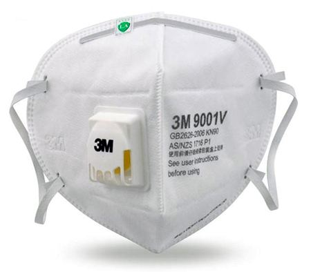
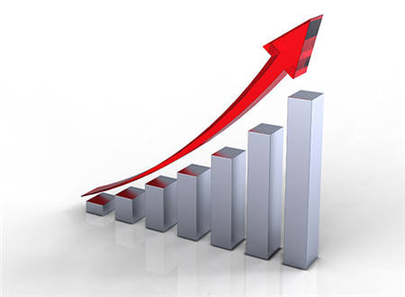
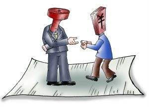

[公众号原文链接](https://mp.weixin.qq.com/s/z6oIAGBWWZcJxGXIHQm1QA)

新冠病毒当前，普通人为数不多的安全手段就是少接触、戴口罩、多洗手。在放假休息、封路封城、挤兑囤积等几方面因素下，口罩已经很难买到了。

1 月末国家市场监管总局通报了几起典型案件：https://tech.sina.com.cn/roll/2020-01-30/doc-iimxxste7605880.shtml

主要以哄抬价格的名义对药店进行了处罚。

这个反应比较符合大家直觉。国家和人民这么急需口罩的时候，“黑心”药店还漫天要价，这是诚心坑人的吧，国家要狠狠的处罚让他们再也不敢这么做！

我今天尝试使用最基本的市场原理来聊一下这个事情，看看能否让大家得到不同的结论。

1. 价格由双方决定。

市场交易最基本的原则就是买卖双方自愿。

口罩价格很高，买家可以不买吗？可以。

只要市场上能以低价满足买家，买家有选择的机会，买家可以不买高价的，去买低价的。

只要低价能大量成交，那说明市场价就是这个低价。也就是说双方自愿达成成交状态的价格，才是市场价。

而不是卖家虚开一个不切实际的高价，就能哄抬物价成功。也不是买家讨价还价成功一次，价格就能下跌。

所谓的“哄抬物价”必须得交易双方配合、自愿才能达成。

2. 为什么会涨价？

但是低价买不到口罩了，这说明什么？说明低价供不应求了，说明买口罩这个需求要多出钱才能满足了。

为什么呢？你觉得价高的时候，其他买家不觉得高，并且将其买至供应稀缺的状态了。

不出高价买不到啊，着急防护的啊。

在股票市场大家都理解，买的人多涨，卖的的人多跌。怎么到了市场上，反而忘了这个基本的原则。

3. 提价是发国难财吗？

那卖家在成本没有增加的时候，突然提价，是不是道德上有问题，是在发国难财呢？

对不起也不是。卖家因为商品滞销，亏本卖货的时候，买家有感谢他发奖状或者多给钱吗？

而且前面也说了价格是双方决定的，不是卖家随便提价就能高价成交。

而且最核心的一点就是，市场上正当交易挣得的利益都是正当的。

举个小例子。

如果现在大家都非常需要口罩，愿意用 20 元每只的价格来收购。

但是政府不许涨价，10 元成本的口罩只允许卖 12 元，会造成什么情况呢？

第一影响就是急需的买家买到的几率变低，比如湖北明显是急需的，西藏就没那么需要。市场价格本可以自然调节和平衡需求。

第二就是催生寻租和黑市。我只要有能力 12 元大量收购进来，转手 14,16,18 都可以轻易出手，这当然会在正常市场外形成套利空间。

寻租呢就是，反正我药店只能买 12。 我卖给你是 12，卖给我家人、我朋友、我领导也是 12，卖给愿意私下给我回扣的也是 12，你说我为啥要买给普通顾客呢？

政策制造稀缺，同时也必然制造寻租和黑市。

4. 提价才能满足需求。

限制价格以后，口罩的产量高，还是放开涨价之后口罩的产量高？

有人说口罩的生产周期长弹性较差，工艺难度高，涨价并不能在短期内刺激生产、加大供给。

就是这种盲目的自信，低估市场的力量，以为聪明到一定程度可以制定出完美的指导市场，才会形成这些年的世界经济乱象。

口罩需求极高、价格猛涨，会带来什么？

首先就是高价的进口商品可以进来了。你能低价买到进口好货吗？

第二防毒面具或者其他更高端的可替代防护商品进入市场或者加大产量了。原本不想到这些太贵了，现在口罩都贵了，这些不就有市场了吗？

第三刺激市场超额生产了。比如口罩厂不咸不淡朝九晚五生产就行，现在市价这么高还好卖，我多雇几个工人多进些原料，日夜不停超额生产。既能赚钱又能为大家做贡献。而且本身价格上涨带来的正向现金流，肯定会有一部分投入再生产。

而限制口罩价格给我们带来了什么？

已经看到一些企业主的说法了。有的说工人过年加班工资给了 3 倍，有的说原料涨了 2 倍。最让我印象深刻的一条是：成本涨了这么多还不让口罩涨价，我可以为国家人民做贡献不挣钱生产纯成本价卖。但是现在我每生产一只都要多亏一分钱，我怎么生产？我有多少钱来亏损？只能停工保活路了。

5. 涨价对穷人不公平吗？

这个博爱的理由貌似可以站在道德高地指责一切市场行为。但是根本站不出脚。

你是房东，你会不会对突然变穷房客半价甚至不收钱？

你是公司老板，你会不会给有负债的员工多发一倍工资？

你去超市购物，会不会因为这个超市快倒闭了就多出钱买东西？

靠干扰市场秩序并不能救穷人，只会让更多人变成穷人。

## 最后的话

> 2 月中旬，国家市场监督管理总局说出现新问题，原材料价格上涨过快。虽然供给仍有缺口，但是价格基本稳定。https://baijiahao.baidu.com/s?id=1657953466914114622

> 2 月下旬，市场监管部门及时查处哄抬口罩价格行为，截至 24 日，已经查办 4500 多家企业。https://baijiahao.baidu.com/s?id=1659492443749918536

市面上依然没有足够的口罩供应。

分析来分析去，说得都是最基本的常识，无需经济学知识和复杂数学计算。但是可惜我们的市场监督机构还在逆市场而动。希望今后的主流经济学发展都够拨乱反正，回归现实和常识。
