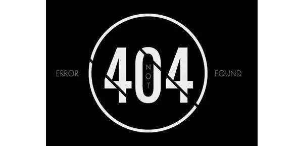

## 起因

这是一篇由于最近两天搜集连岳十年前的旧博文引发的对互联网的思考。

契机是腾讯大家被关闭了，在我的大概印象里，大家中的文章质量相对还是挺高的，立场和风格也截然不同，有偏五毛的偏美分的，但整体还是偏专业。结果说关就被关，一点音信都没了。这可是腾讯啊，这可是十亿国内用户的企鹅帝国的产品啊。

由于我业余在维护着一个保存整理备份连岳文章的网站 http://www.lianyue4u.com ，之前由于版权原因没有转载过他发表在大家里的文章，现在内容清空悔之莫及。

所以这两天就用了一点时间，想搜集一下前些年的文章。（主要是 2013 年以前还未以微信公众号作为主阵地前的文章）

## 过程

都说互联网是有记忆的，但是一个影响力这么大的作家的文章，居然真的说没就没。探究起来各种当年的阵地，好多已经烟消云散。

查到比较早的博客地址有：

2006 年左右 http://lianyeah.blog.com/ 整个 blog.com 已经灭了。

2007 年左右 牛博网 http://www.bullog.cn/blogs/rosu/Default.aspx http://www.bullock.cn/blogs/lianyue 以及自建博客 http://www.lianyue.net。多次被墙后整站关闭了。

2009 年左右 新浪博客 http://blog.sina.com.cn/lyeah 尚留着几篇文章。

新浪微博多次被审查后，也宣告个人退出。

腾讯大家 https://dajia.qq.com/ 2020 年彻底被关停。

2013 年至今的主要阵地就在微信公众号了。但是公众号多篇文章也被举报被删除，网上能找到的我都进行了收录。

一些涉及到的热点新闻链接，地方网站也大都已经关停。还有一部分网站页面删除或者地址链接改版，内容消失。不过天涯和豆瓣的还保存完好。

当然这里要感谢一个挖掘神器 https://web.archive.org/ ，对很多网页有按时间线保存的快照，所以才能找回一部分文章内容。

牛博网最可惜的是使用的 asp.net 的代码分页模式，所以快照里只能找出首页内容，后续分页的统统点不开。这也给我一个页面静态化还是非常必要的教训，在 Vue 和 React 技术广泛使用的今天，内容静态化和长久保存抓取就更难实现了。

## 结果

看快照结果，估计恢复了 90%左右腾讯大家的文章，和 30%左右牛博网的文章。

2007 年左右关于厦门 PX 相关的博文尤其紧张和刺激。当时绝大多数人都认为这事没戏，因为这是强力的地方政府大力推广建设的重点项目，连岳也表达出了一些悲观情绪，但是仍然号召大家行动起来，就算是为下一次事件下一个城市做准备都有切实的意义。所以当最终这件真的翻盘，从缓建到搬迁的时候，大家真的被震惊了，也真正的展示了群众和民意的力量。而之后几年搬迁到漳州的项目发生了爆炸时，更是实证了大家的担忧和反抗有理有据，判断准确。连岳在整个事件中实际发挥了公共意见领袖的作用，重读那些很有说服力文字和了解期间的紧张情绪和事态，真的很感恩这个时代有幸。

我相信连岳的认识和文章水平是超前时代的，所以冒风险做一个这样小众的、未被有关部门盯上和谐的小角落的很有必要的。希望今后的中国能更宽容的看待言论，更广泛的允许舆论监督，也更少的审查和封禁。
