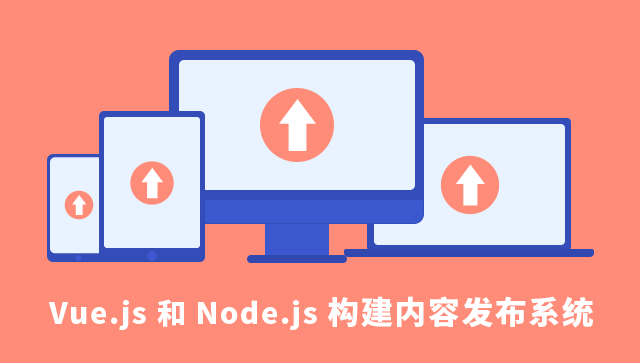
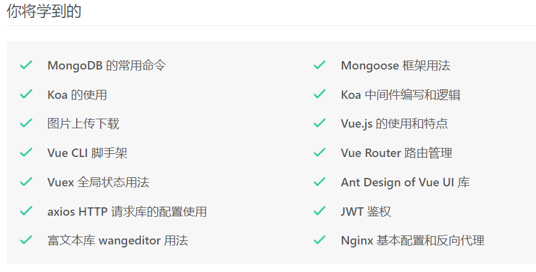

一个不懂编程的外行想要学习编程，我认为最简单快速的方式就是有人带着编写一个基础的实例，迅速接触和了解程序开发中的各种工具和写法，先跑起来看到效果，然后一步步再吃透其中的知识点和技巧。所以本人很欣赏实验楼这种直接提供教学和相应开发环境的模式，在网页中就可以边浏览教程边手敲代码，一步步的吸收和吃透。而不像我们平时看书看视频教程那样，学习过程中觉得好简单啊都不难理解，等实际上手时一行代码都写不出来。

年初的时候通过实验楼的环境制作了一套全栈课程，包括了前端、后端、数据库、发布等整套开发上线流程。课程内容是从头构建实现一个前后端分离的内容发布系统。内容发布系统作为基础的网站应用，可以用于新闻、博客、官网、论坛、社区等各种用途。

课程应用技术栈为 Vue.js + Koa + MongoDB + Nginx，会从头介绍各个技术的基本情况和使用方法，并快速的应用服务于项目。

前端部分，课程会介绍了 Vue.js 的特点和用法，以及 Vue Router 和 Vuex。同时会引入 Ant design of Vue 框架，wangeditor 富文本库，Axios 请求库等，实现了用户注册登录，权限管理，前端路由导航，用户信息修改和头像上传，文章的发布页、浏览页、列表页和修改删除等功能，以及评论的相关功能。

后端部分则会完成如 RESTful API 编写，用户鉴权，图片上传下载，数据库增查改删操作，并系统的介绍了 Koa 中间件的写法和用法。

作为一个全栈入门项目，课程编写中非常注意降低门槛，零基础都可以直接学习。涉及到的代码和用法都有浅显的解释和介绍，并穿插了一些 Linux 命令和 ES6 语法之类的小技巧，最后还详细指导大家如何在空白 Linux 服务器上配置环境、部署程序。教程中涉及的知识点都尽量使用了到 2019 年底为止的最新内容，没有使用旧版本的库、资料以及不再推荐的技术。

课程地址为[《Vue.js 和 Node.js 构建内容发布系统》](https://www.shiyanlou.com/courses/1505)

通过教师邀请码: `2Y4iA1cu`购买可享 **9 折优惠**。

通过邀请码购买的前 100 名还可以获得 **10 元现金红包**，通过邀请码购买后截图发送给微信号 Sabercon 领取。**推荐他人购买**也有同样的返现机会，详情联系微信，欢迎分享。

谢谢！
