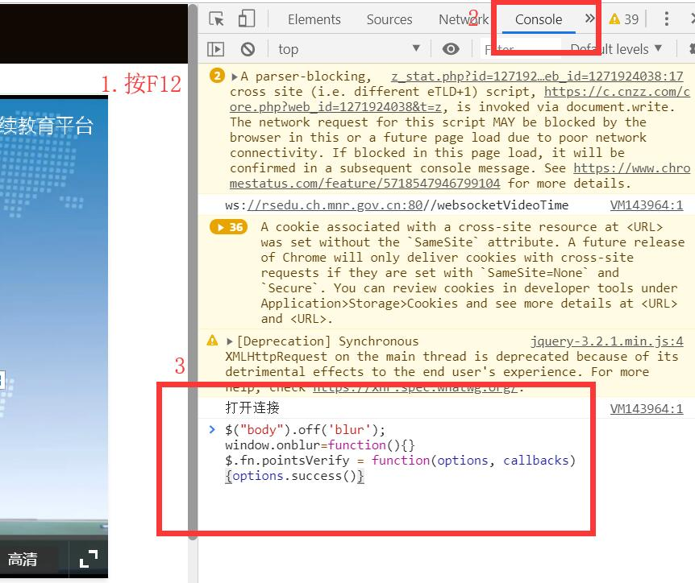
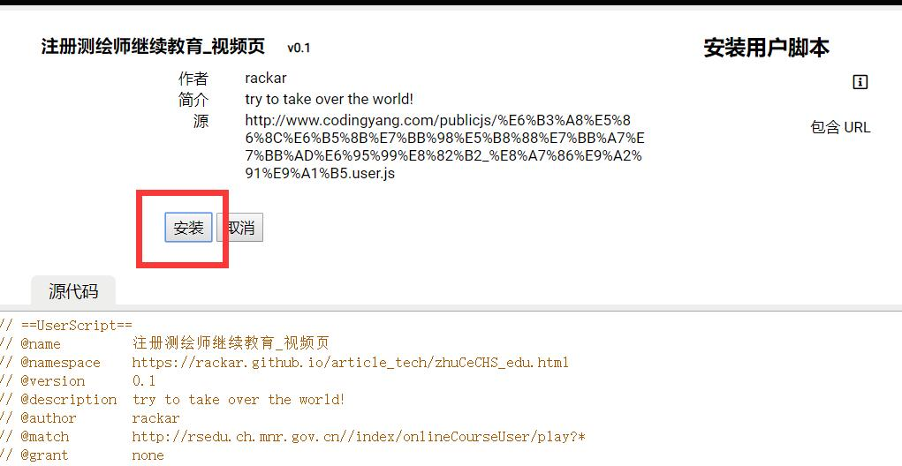
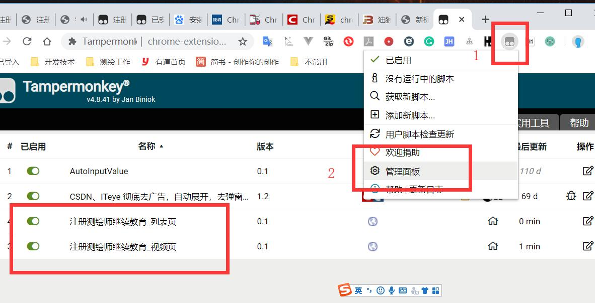
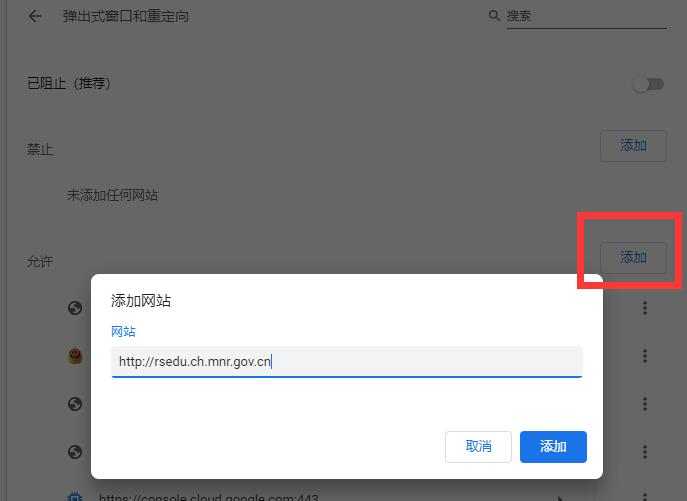

继续教育视频课有 10 分钟一次的验证码还不允许最小化窗口做别的工作，所以提供一个小脚本屏蔽掉失焦点视频暂停和验证码。

另外又写了一个油猴脚本，可以全自动听课，但是有一点配置门槛，详细步骤附在后面。

## 视频页脚本（无需插件）

#### 脚本代码

复制下面 3 行

```js
$("body").off("blur");
window.onblur = function() {};
$.fn.pointsVerify = function(options, callbacks) {
  options.success();
};
```

#### 用法

打开课程点 F12，找到 Console 标签，在下方箭头输入处粘贴这 3 行代码，回车就行。



缺点是播放完了过一会又会重头放，看到弹框提示"记录已更新"就说明整节课听完了。

## 油猴自动挂机脚本

这个有点难度，要在谷歌 Chrome 浏览器里安装油猴插件，然后导入我的 2 个脚本。

不过用法就简单了。进入继续教育页课程列表，然后就什么都不用做了，未完成的课程会**全自动**完整顺序播放。

#### 油猴插件安装

自行搜索 Chrome 安装油猴插件的方法，如果不能翻墙直接安装，可以搜索开发者模式离线安装 Chrome 插件的方法。

或者参考本文：[Chrome 安装油猴插件](./zhuceYouhou)

#### 脚本下载安装

油猴插件安装好以后，点击下面 4 个链接下载脚本。然后点击安装

[必修列表页脚本](https://github.com/Rackar/myTamperMonkeyLibs/raw/master/bixiu_list.user.js)

[必修视频页脚本](https://github.com/Rackar/myTamperMonkeyLibs/raw/master/bixiu_video.user.js)

[选修列表页脚本](https://github.com/Rackar/myTamperMonkeyLibs/raw/master/xuanxiu_list.user.js)

[选修视频页脚本](https://github.com/Rackar/myTamperMonkeyLibs/raw/master/xuanxiu_video.user.js)



安装完成之后，可以按下图顺序点击查看是否正常启用。


点击进入课程列表页，等待 4 秒之后自动开始播放课程。最小化之后依然播放，说明全部正常。不要手动开启关闭页面，最小化放一整天等待学习全部完成。

视频到时间之后会自动进入下一节课，**但是要注意浏览器默认会拦截弹出窗口，导致下一节课的内容无法弹出**，按下章设置允许弹窗。

## 设置 Chrome 允许本站弹出窗口

Chrome 设置，拉到最下方，高级——隐私设置与安全——网站设置——弹出式窗口和重定向。

允许——添加 `http://rsedu.ch.mnr.gov.cn:80`


