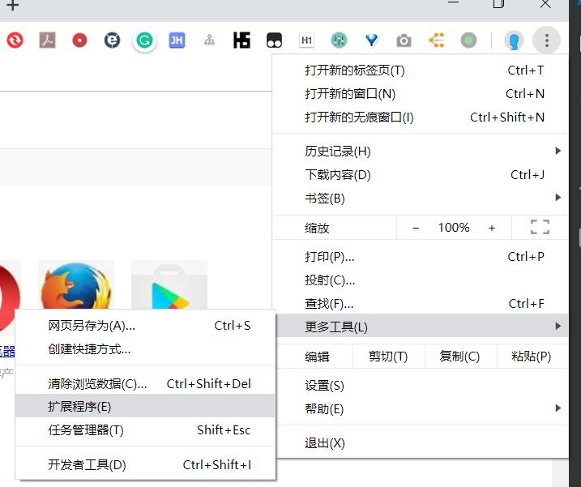

Tampermonkey（油猴）插件，可以直接在网页上运行 js 脚本，简化操作。

有翻墙条件可以直接安装，否则只好使用开发者模式安装。

## 直接安装（需翻墙）

点击 [Tampermonkey](https://chrome.google.com/webstore/detail/tampermonkey/dhdgffkkebhmkfjojejmpbldmpobfkfo) 安装

或者从 Chrome 商店搜索：

点击右上角三个点——更多工具——扩展程序

点击左上角三个横，打开 Chrome 网上应用商店,搜索 Tampermonkey，点击添加到 Chrome。我这里已经安装了所以按钮显示为评分。

完成安装

## 开发者模式安装

搜索 Tampermonkey（油猴）离线安装，主要就是将下载来的 ctx 文件用 zip 形式解压。开启开发者模式，选择解压后的目录。

#### 下载

地址：[百度网盘](https://pan.baidu.com/s/1ylmQULE29O8tgcxtAbDUgQ)

#### 安装

使用开发模式安装：

1. 把下载后的.crx 扩展名的离线 Chrome 插件的文件扩展名改成.zip
2. 解压压缩文件到一个非临时目录
3. 如上图打开 Chrome 浏览器的扩展程序管理界面，并在该界面的最右上方的开发者模式按钮上打勾
4. 在勾选开发者模式选项以后，在该页面就会出现加载正在开发的扩展程序等按钮，点击“加载正在开发的扩展程序”按钮，并选择刚刚解压的 Chrome 插件文件夹的位置
5. 即可安装完成
