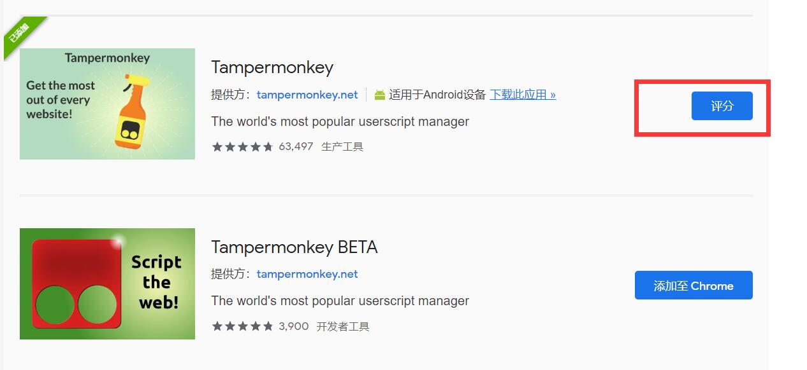

# Chrome 安装油猴插件

Tampermonkey（油猴）插件，可以直接在网页上运行 js 脚本，简化操作。

## 直接安装（需翻墙）

点击右上角三个点——更多工具——扩展程序

点击左上角三个横，打开 Chrome 网上应用商店,搜索 Tampermonkey，点击添加到 Chrome。我这里已经安装了所以按钮显示为评分。

## 开发者模式安装

搜索 Tampermonkey（油猴）离线安装，主要就是将下载来的 ctx 文件用 zip 形式解压。开启开发者模式，选择解压后的目录。
